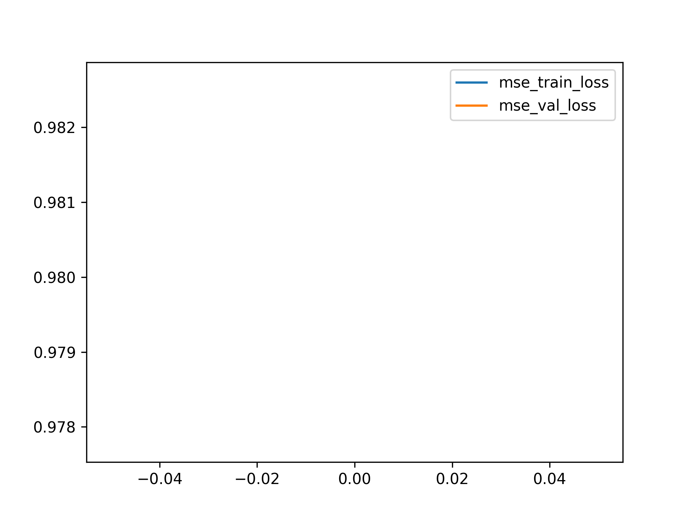

Example Report
==============

# Objective


Training Models using the ModelTrainer Class  

# Model Used


```
=================================================================
Layer (type:depth-idx)                   Param #
=================================================================
PerceptronBD                             --
├─Sequential: 1-1                        --
│    └─Linear: 2-1                       820
│    └─BatchNorm1d: 2-2                  40
│    └─Dropout1d: 2-3                    --
│    └─ReLU: 2-4                         --
│    └─Linear: 2-5                       210
│    └─BatchNorm1d: 2-6                  20
│    └─Dropout1d: 2-7                    --
│    └─ReLU: 2-8                         --
│    └─Linear: 2-9                       110
│    └─BatchNorm1d: 2-10                 20
│    └─Dropout1d: 2-11                   --
│    └─ReLU: 2-12                        --
│    └─Linear: 2-13                      77
│    └─Flatten: 2-14                     --
=================================================================
Total params: 1,297
Trainable params: 1,297
Non-trainable params: 0
=================================================================
```  

# Loss Curves
  
  
  
