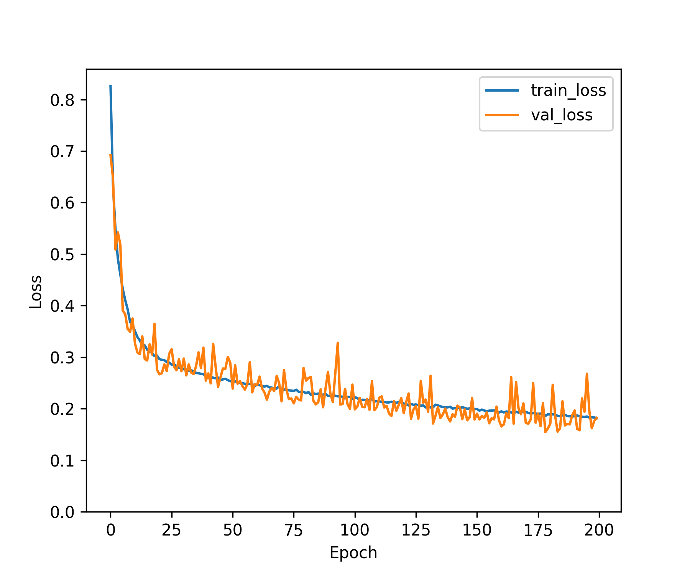
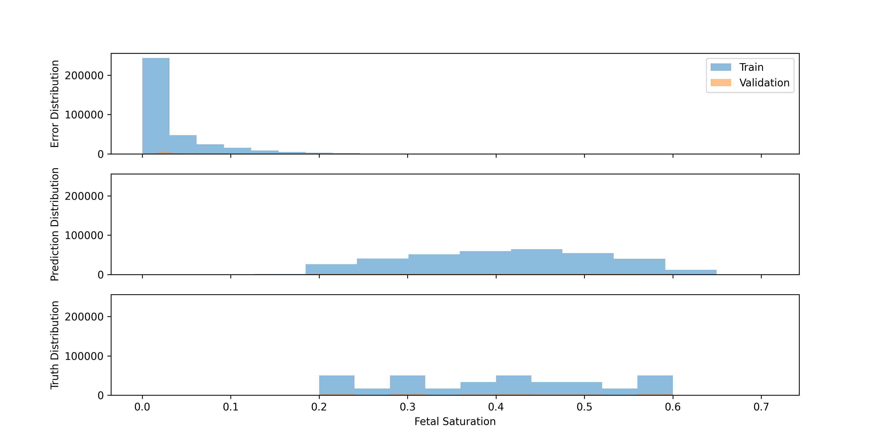

Performance of Affine Coupling Invertible Neural Network
========================================================

# Objective

Test the effectiveness of affine coupling layer with zero bias in the final layer, trained with 0.007 STD noise added  

# Training Curves
  
  
  

# MSE Errors (Normalized)
  
<!DOCTYPE html>
<head>
<meta charset="UTF-8">

</head>
<html>
<body>
    <pre style="font-family:Menlo,'DejaVu Sans Mono',consolas,'Courier New',monospace"><code>               Losses                
┏━━━━┳━━━━━━━━━━━━┳━━━━━━━━━━━━━━━━━┓
┃ 👀 ┃ Train Loss ┃ Validation Loss ┃
┡━━━━╇━━━━━━━━━━━━╇━━━━━━━━━━━━━━━━━┩
│    │   0.1818   │     0.1820      │
└────┴────────────┴─────────────────┘
</code></pre>
</body>
</html>

# MAE Errors (Unscaled)
  
<!DOCTYPE html>
<head>
<meta charset="UTF-8">

</head>
<html>
<body>
    <pre style="font-family:Menlo,'DejaVu Sans Mono',consolas,'Courier New',monospace"><code>                                   Error Statistics                                    
┏━━━━━━━━━━━━━━━━━━━━━━━━━┳━━━━━━━━━━━━┳━━━━━━━━━━━┳━━━━━━━━━━━━━━━━━┳━━━━━━━━━━━━━━━━┓
┃ Maternal Wall Thickness ┃ Train Mean ┃ Train Std ┃ Validation Mean ┃ Validation Std ┃
┡━━━━━━━━━━━━━━━━━━━━━━━━━╇━━━━━━━━━━━━╇━━━━━━━━━━━╇━━━━━━━━━━━━━━━━━╇━━━━━━━━━━━━━━━━┩
│ 4.0                     │     0.0067 │    0.0067 │                 │                │
│ 5.0                     │     0.0138 │    0.0139 │                 │                │
│ 6.0                     │     0.0089 │    0.0089 │                 │                │
│ 7.0                     │     0.0057 │    0.0058 │                 │                │
│ 8.0                     │     0.0138 │    0.0141 │                 │                │
│ 9.0                     │     0.0085 │    0.0083 │                 │                │
│ 10.0                    │     0.0126 │    0.0127 │                 │                │
│ 11.0                    │     0.0150 │    0.0149 │                 │                │
│ 12.0                    │     0.0096 │    0.0099 │                 │                │
│ 13.0                    │     0.0184 │    0.0185 │                 │                │
│ 14.0                    │     0.0207 │    0.0211 │                 │                │
│ 15.0                    │     0.0266 │    0.0268 │                 │                │
│ 16.0                    │     0.0214 │    0.0212 │                 │                │
│ 17.0                    │     0.0227 │    0.0222 │                 │                │
│ 18.0                    │     0.0398 │    0.0390 │                 │                │
│ 19.0                    │     0.0411 │    0.0403 │                 │                │
│ 20.0                    │     0.0569 │    0.0579 │                 │                │
│ 21.0                    │     0.0577 │    0.0571 │                 │                │
│ 22.0                    │     0.0818 │    0.0813 │                 │                │
│ 23.0                    │     0.0682 │    0.0690 │                 │                │
│ 24.0                    │     0.0762 │    0.0751 │                 │                │
│ 25.0                    │     0.0954 │    0.0925 │                 │                │
└─────────────────────────┴────────────┴───────────┴─────────────────┴────────────────┘
</code></pre>
</body>
</html>

# Error Distribution
  
  
  

# Trainer Details

        Model Properties:
        INN2(
  (model): Sequential(
    (0): AffineCouplingLayer(
      (s): Sequential(
        (0): Linear(in_features=20, out_features=20, bias=True)
        (1): ReLU()
        (2): Linear(in_features=20, out_features=20, bias=True)
        (3): ReLU()
        (4): Linear(in_features=20, out_features=20, bias=True)
        (5): ReLU()
      )
      (t): Sequential(
        (0): Linear(in_features=20, out_features=20, bias=True)
        (1): ReLU()
        (2): Linear(in_features=20, out_features=20, bias=True)
        (3): ReLU()
        (4): Linear(in_features=20, out_features=20, bias=True)
        (5): ReLU()
      )
    )
    (1): BatchNorm1d(40, eps=1e-05, momentum=0.1, affine=True, track_running_stats=True)
    (2): AffineCouplingLayer(
      (s): Sequential(
        (0): Linear(in_features=20, out_features=20, bias=True)
        (1): ReLU()
        (2): Linear(in_features=20, out_features=20, bias=True)
        (3): ReLU()
        (4): Linear(in_features=20, out_features=20, bias=True)
        (5): ReLU()
      )
      (t): Sequential(
        (0): Linear(in_features=20, out_features=20, bias=True)
        (1): ReLU()
        (2): Linear(in_features=20, out_features=20, bias=True)
        (3): ReLU()
        (4): Linear(in_features=20, out_features=20, bias=True)
        (5): ReLU()
      )
    )
    (3): BatchNorm1d(40, eps=1e-05, momentum=0.1, affine=True, track_running_stats=True)
    (4): AffineCouplingLayer(
      (s): Sequential(
        (0): Linear(in_features=20, out_features=20, bias=True)
        (1): ReLU()
        (2): Linear(in_features=20, out_features=20, bias=True)
        (3): ReLU()
        (4): Linear(in_features=20, out_features=20, bias=True)
        (5): ReLU()
      )
      (t): Sequential(
        (0): Linear(in_features=20, out_features=20, bias=True)
        (1): ReLU()
        (2): Linear(in_features=20, out_features=20, bias=True)
        (3): ReLU()
        (4): Linear(in_features=20, out_features=20, bias=True)
        (5): ReLU()
      )
    )
    (5): BatchNorm1d(40, eps=1e-05, momentum=0.1, affine=True, track_running_stats=True)
    (6): Linear(in_features=40, out_features=1, bias=False)
  )
)
        Data Loader Properties:
        365904 rows, 40 x columns, 1 y columns
        Batch Size: 2048
        X Columns: ['10_1.0_2_/_10_1.0_1', '15_1.0_2_/_15_1.0_1', '19_1.0_2_/_19_1.0_1', '24_1.0_2_/_24_1.0_1', '28_1.0_2_/_28_1.0_1', '33_1.0_2_/_33_1.0_1', '37_1.0_2_/_37_1.0_1', '41_1.0_2_/_41_1.0_1', '46_1.0_2_/_46_1.0_1', '50_1.0_2_/_50_1.0_1', '55_1.0_2_/_55_1.0_1', '59_1.0_2_/_59_1.0_1', '64_1.0_2_/_64_1.0_1', '68_1.0_2_/_68_1.0_1', '72_1.0_2_/_72_1.0_1', '77_1.0_2_/_77_1.0_1', '81_1.0_2_/_81_1.0_1', '86_1.0_2_/_86_1.0_1', '90_1.0_2_/_90_1.0_1', '94_1.0_2_/_94_1.0_1', '10_2.0_2_/_10_2.0_1', '15_2.0_2_/_15_2.0_1', '19_2.0_2_/_19_2.0_1', '24_2.0_2_/_24_2.0_1', '28_2.0_2_/_28_2.0_1', '33_2.0_2_/_33_2.0_1', '37_2.0_2_/_37_2.0_1', '41_2.0_2_/_41_2.0_1', '46_2.0_2_/_46_2.0_1', '50_2.0_2_/_50_2.0_1', '55_2.0_2_/_55_2.0_1', '59_2.0_2_/_59_2.0_1', '64_2.0_2_/_64_2.0_1', '68_2.0_2_/_68_2.0_1', '72_2.0_2_/_72_2.0_1', '77_2.0_2_/_77_2.0_1', '81_2.0_2_/_81_2.0_1', '86_2.0_2_/_86_2.0_1', '90_2.0_2_/_90_2.0_1', '94_2.0_2_/_94_2.0_1']
        Y Columns: ['Fetal Saturation']
        
        Validation Method:
        Split the data randomly using np.random.shuffle with a split of 0.8
        Loss Function:
        Torch Loss Function: MSELoss()
        Optimizer Properties":
        SGD (
Parameter Group 0
    dampening: 0
    differentiable: False
    foreach: None
    lr: 0.001
    maximize: False
    momentum: 0.89
    nesterov: True
    weight_decay: 0
)
          
