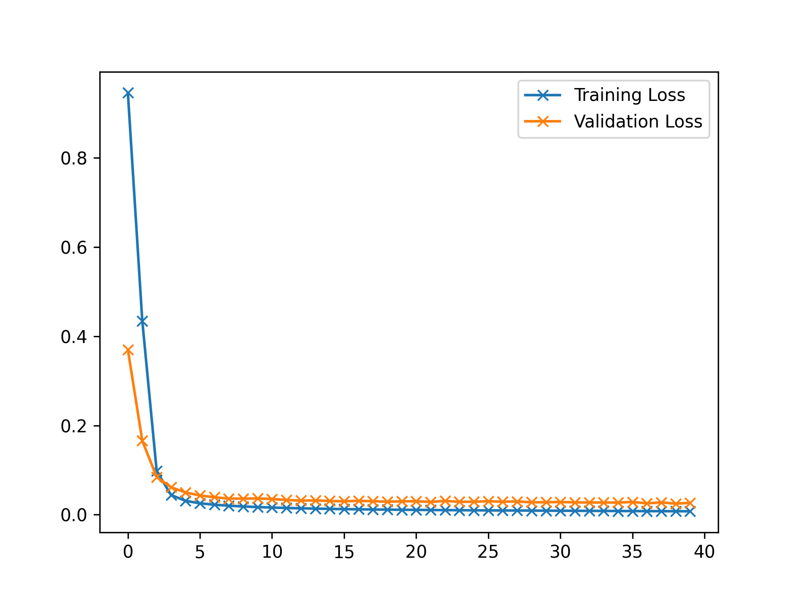
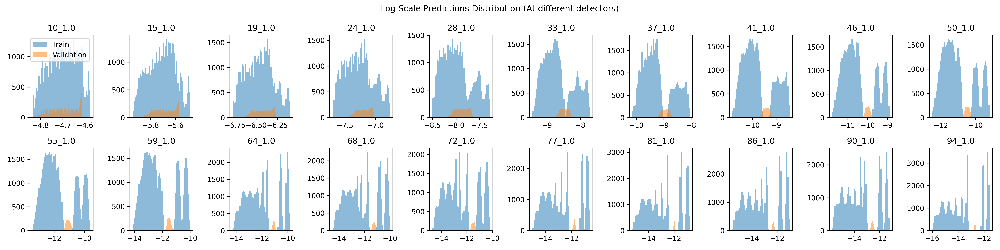
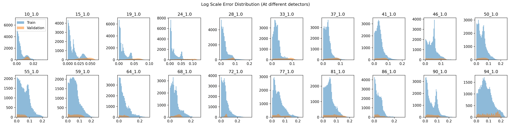

Forward Modelling Report (WV1)
==============================

# Objective


Shrinking the network to see if it can still learn the data  

# Data Length


48384  

# Model Used


```
=================================================================
Layer (type:depth-idx)                   Param #
=================================================================
PerceptronBD                             --
├─Sequential: 1-1                        --
│    └─Linear: 2-1                       30
│    └─BatchNorm1d: 2-2                  10
│    └─Dropout1d: 2-3                    --
│    └─ReLU: 2-4                         --
│    └─Linear: 2-5                       60
│    └─BatchNorm1d: 2-6                  20
│    └─Dropout1d: 2-7                    --
│    └─ReLU: 2-8                         --
│    └─Linear: 2-9                       220
│    └─Flatten: 2-10                     --
=================================================================
Total params: 340
Trainable params: 340
Non-trainable params: 0
=================================================================
```  

# Model Trainer Params


```

        Model Properties:
        PerceptronBD(
  (model): Sequential(
    (0): Linear(in_features=5, out_features=5, bias=True)
    (1): BatchNorm1d(5, eps=1e-05, momentum=0.1, affine=True, track_running_stats=True)
    (2): Dropout1d(p=0.01, inplace=False)
    (3): ReLU()
    (4): Linear(in_features=5, out_features=10, bias=True)
    (5): BatchNorm1d(10, eps=1e-05, momentum=0.1, affine=True, track_running_stats=True)
    (6): Dropout1d(p=0.01, inplace=False)
    (7): ReLU()
    (8): Linear(in_features=10, out_features=20, bias=True)
    (9): Flatten(start_dim=1, end_dim=-1)
  )
)
        Optimizer Properties"
        SGD (
Parameter Group 0
    dampening: 0
    differentiable: False
    foreach: None
    lr: 0.0003
    maximize: False
    momentum: 0.89
    nesterov: False
    weight_decay: 0
)
        DataLoader Params: 
            Batch Size: 32
            Validation Method: Holds out fMaternal Wall Thickness columns -0.6546536707079772 for validation. The rest are used             for training
        Loss:
            Train Loss: 0.007544580449294566
            Val. Loss: 0.026395564090716774
```  

# Loss Curves
  
  
  

# Prediction Distribution
  
  
  

# Error Distribution
  
  
  
