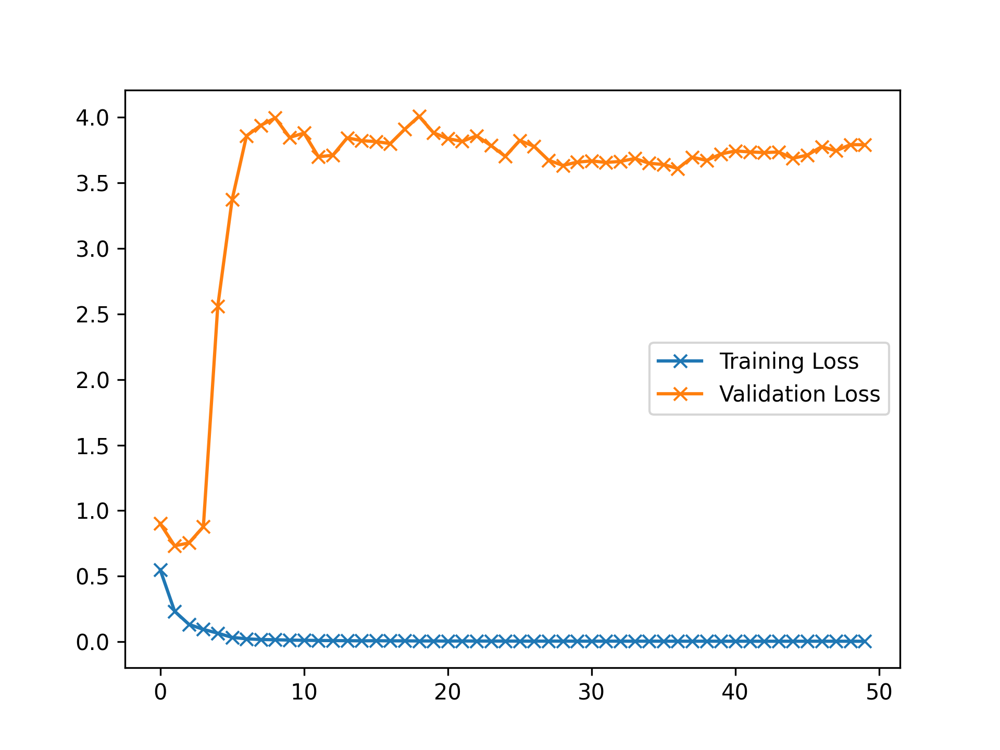
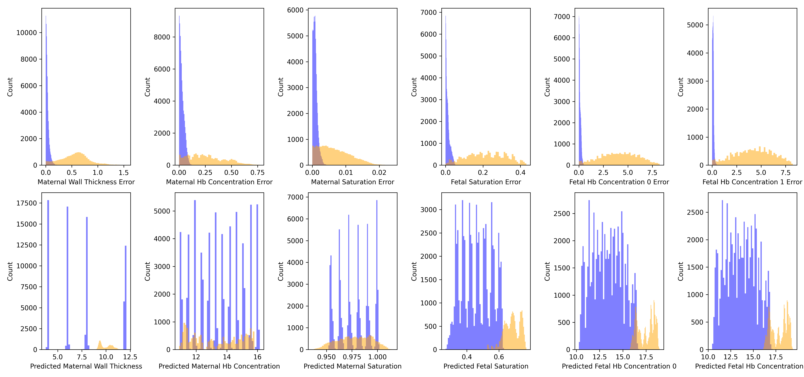

Inverse Modelling Report
========================

# Objective


Check with Log I2 and I1 data as input and multiple outputs  

# Comments


Got similar performances to report1 with using 1/4th the parameters (1k-ish as opposed to 4k~)  

# Data Length


90720  

# Model Used


```
=================================================================
Layer (type:depth-idx)                   Param #
=================================================================
SplitChannelCNN                          --
├─CNN2FC: 1-1                            --
│    └─CNN1d: 2-1                        --
│    │    └─Sequential: 3-1              2,248
│    └─PerceptronBD: 2-2                 --
│    │    └─Sequential: 3-2              1,926
=================================================================
Total params: 4,174
Trainable params: 4,174
Non-trainable params: 0
=================================================================
```  

# Model Trainer Params


```

        Model Properties:
        SplitChannelCNN(
  (network): CNN2FC(
    (cnn): CNN1d(
      (model): Sequential(
        (0): Conv1d(4, 8, kernel_size=(10,), stride=(1,), groups=4)
        (1): BatchNorm1d(8, eps=1e-05, momentum=0.1, affine=True, track_running_stats=True)
        (2): ReLU()
        (3): Conv1d(8, 16, kernel_size=(5,), stride=(1,), groups=4)
        (4): BatchNorm1d(16, eps=1e-05, momentum=0.1, affine=True, track_running_stats=True)
        (5): ReLU()
        (6): Conv1d(16, 32, kernel_size=(5,), stride=(1,), groups=4)
        (7): BatchNorm1d(32, eps=1e-05, momentum=0.1, affine=True, track_running_stats=True)
        (8): ReLU()
        (9): Conv1d(32, 48, kernel_size=(3,), stride=(1,), groups=4)
        (10): Flatten(start_dim=1, end_dim=-1)
      )
    )
    (fc): PerceptronBD(
      (model): Sequential(
        (0): Linear(in_features=48, out_features=30, bias=True)
        (1): BatchNorm1d(30, eps=1e-05, momentum=0.1, affine=True, track_running_stats=True)
        (2): ReLU()
        (3): Linear(in_features=30, out_features=10, bias=True)
        (4): BatchNorm1d(10, eps=1e-05, momentum=0.1, affine=True, track_running_stats=True)
        (5): ReLU()
        (6): Linear(in_features=10, out_features=6, bias=True)
        (7): Flatten(start_dim=1, end_dim=-1)
      )
    )
  )
)
        Optimizer Properties"
        SGD (
Parameter Group 0
    dampening: 0
    differentiable: False
    foreach: None
    lr: 0.001
    maximize: False
    momentum: 0.91
    nesterov: False
    weight_decay: 0.0001
)
        DataLoader Params: 
            Batch Size: 4096
            Validation Method: Holds out fMaternal Wall Thickness columns 0.7071067811865475 for validation. The rest are used             for training
        Loss:
            Train Loss: 0.004158976568967331
            Val. Loss: 3.7899816444100947
```  

# Loss Curves
  
  
  

# Prediction & Error Distribution
  
  
  
