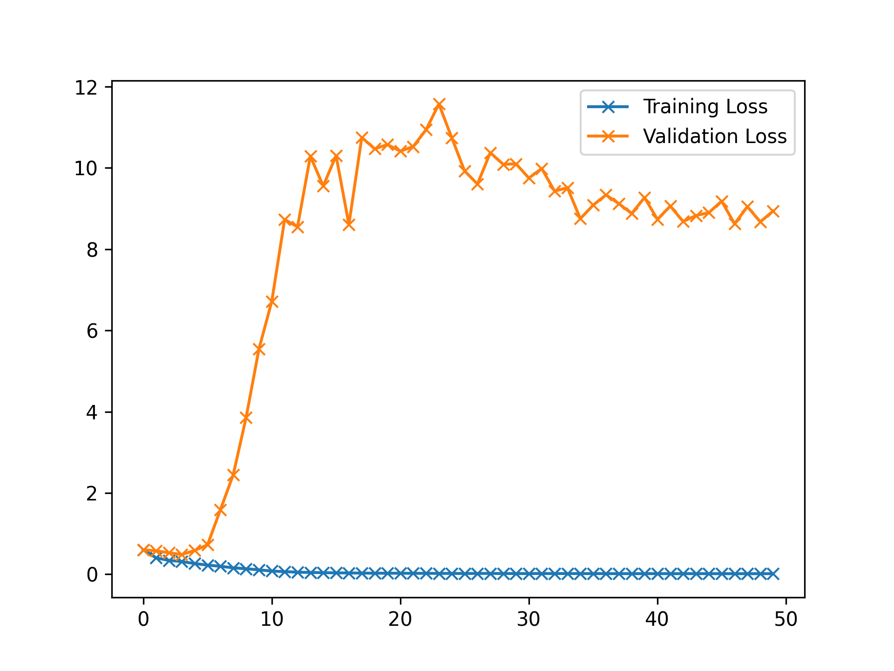
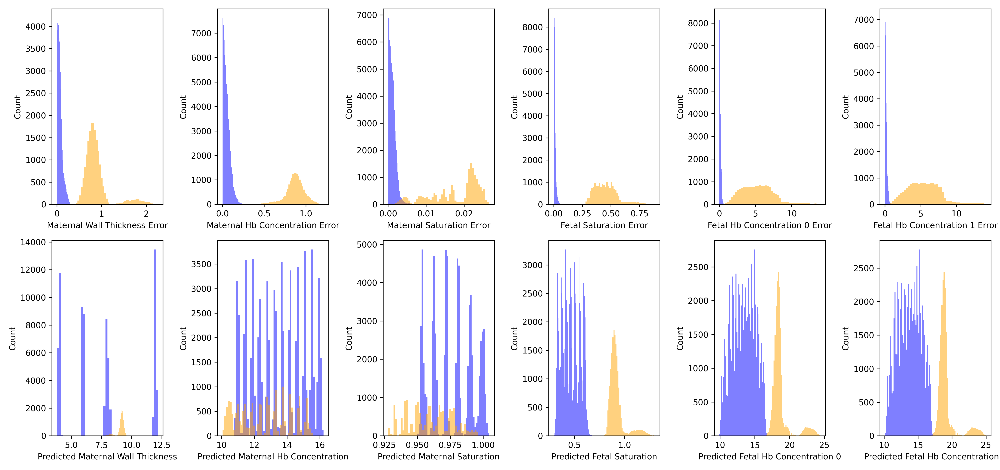

Inverse Modelling Report
========================

# Objective


Check with Log I2 and I1 data as input and multiple outputs  

# Comments


Anything under 3 layers in the CNN part degrades performance. Sticking to at least 3!  

# Data Length


90720  

# Model Used


```
=================================================================
Layer (type:depth-idx)                   Param #
=================================================================
SplitChannelCNN                          --
├─CNN2FC: 1-1                            --
│    └─CNN1d: 2-1                        --
│    │    └─Sequential: 3-1              148
│    └─PerceptronBD: 2-2                 --
│    │    └─Sequential: 3-2              1,458
=================================================================
Total params: 1,606
Trainable params: 1,606
Non-trainable params: 0
=================================================================
```  

# Model Trainer Params


```

        Model Properties:
        SplitChannelCNN(
  (network): CNN2FC(
    (cnn): CNN1d(
      (model): Sequential(
        (0): Conv1d(4, 4, kernel_size=(10,), stride=(1,), groups=4)
        (1): BatchNorm1d(4, eps=1e-05, momentum=0.1, affine=True, track_running_stats=True)
        (2): ReLU()
        (3): Conv1d(4, 16, kernel_size=(5,), stride=(1,), groups=4)
        (4): Flatten(start_dim=1, end_dim=-1)
      )
    )
    (fc): PerceptronBD(
      (model): Sequential(
        (0): Linear(in_features=112, out_features=12, bias=True)
        (1): BatchNorm1d(12, eps=1e-05, momentum=0.1, affine=True, track_running_stats=True)
        (2): ReLU()
        (3): Linear(in_features=12, out_features=6, bias=True)
        (4): Flatten(start_dim=1, end_dim=-1)
      )
    )
  )
)
        Optimizer Properties"
        SGD (
Parameter Group 0
    dampening: 0
    differentiable: False
    foreach: None
    lr: 0.001
    maximize: False
    momentum: 0.91
    nesterov: False
    weight_decay: 0.0001
)
        DataLoader Params: 
            Batch Size: 4096
            Validation Method: Holds out fMaternal Wall Thickness columns 0.7071067811865475 for validation. The rest are used             for training
        Loss:
            Train Loss: 0.013059675567241375
            Val. Loss: 8.938926666501969
```  

# Loss Curves
  
  
  

# Prediction & Error Distribution
  
  
  
