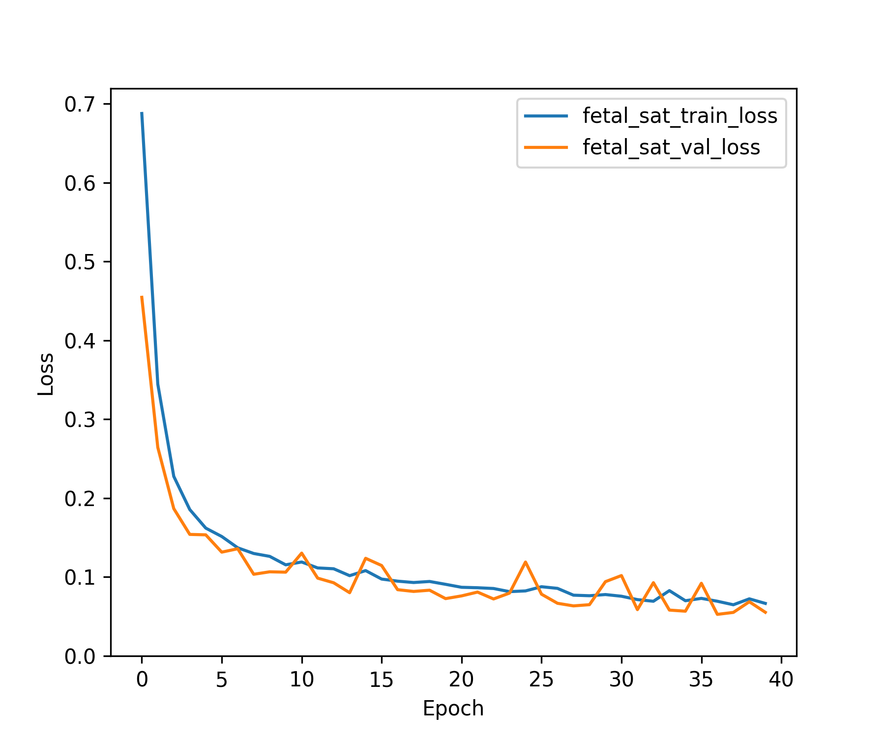
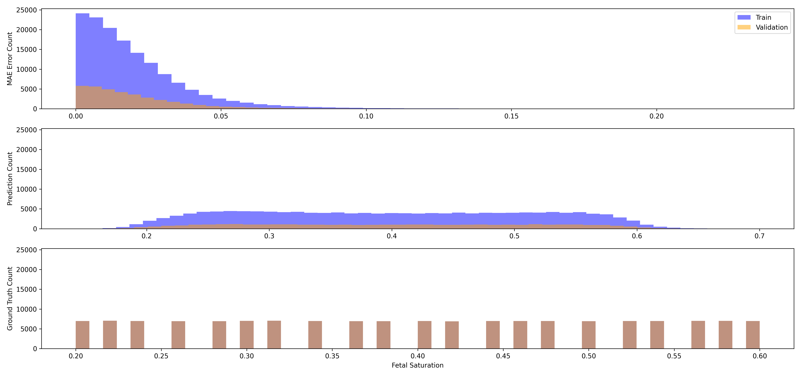

Inverse Modelling Using SkipConnect For Depth
=============================================

# Objective


Predicting only Fetal Saturation using SkipConnect to pass the Model Depth to the first hidden layer  

# Comments


Works for the random split case!  

# Data Length


182952  

# Model Used


```
=================================================================
Layer (type:depth-idx)                   Param #
=================================================================
SkipConnect                              --
├─Sequential: 1-1                        --
│    └─Linear: 2-1                       1,640
├─Sequential: 1-2                        --
│    └─BatchNorm1d: 2-2                  82
│    └─ReLU: 2-3                         --
│    └─Linear: 2-4                       840
│    └─BatchNorm1d: 2-5                  40
│    └─ReLU: 2-6                         --
│    └─Linear: 2-7                       21
│    └─Flatten: 2-8                      --
=================================================================
Total params: 2,623
Trainable params: 2,623
Non-trainable params: 0
=================================================================
```  

# Model Trainer Params


```

        Model Properties:
        SkipConnect(
  (left_network): Sequential(
    (0): Linear(in_features=40, out_features=40, bias=True)
  )
  (right_network): Sequential(
    (0): BatchNorm1d(41, eps=1e-05, momentum=0.1, affine=True, track_running_stats=True)
    (1): ReLU()
    (2): Linear(in_features=41, out_features=20, bias=True)
    (3): BatchNorm1d(20, eps=1e-05, momentum=0.1, affine=True, track_running_stats=True)
    (4): ReLU()
    (5): Linear(in_features=20, out_features=1, bias=True)
    (6): Flatten(start_dim=1, end_dim=-1)
  )
)
        Data Loader Properties:
        182952 rows, 41 x columns, 1 y columns
        Batch Size: 2048
        X Columns: ['Maternal Wall Thickness', '10_2.0_1_/_10_2.0_2', '15_2.0_1_/_15_2.0_2', '19_2.0_1_/_19_2.0_2', '24_2.0_1_/_24_2.0_2', '28_2.0_1_/_28_2.0_2', '33_2.0_1_/_33_2.0_2', '37_2.0_1_/_37_2.0_2', '41_2.0_1_/_41_2.0_2', '46_2.0_1_/_46_2.0_2', '50_2.0_1_/_50_2.0_2', '55_2.0_1_/_55_2.0_2', '59_2.0_1_/_59_2.0_2', '64_2.0_1_/_64_2.0_2', '68_2.0_1_/_68_2.0_2', '72_2.0_1_/_72_2.0_2', '77_2.0_1_/_77_2.0_2', '81_2.0_1_/_81_2.0_2', '86_2.0_1_/_86_2.0_2', '90_2.0_1_/_90_2.0_2', '94_2.0_1_/_94_2.0_2', '10_1.0_1_/_10_1.0_2', '15_1.0_1_/_15_1.0_2', '19_1.0_1_/_19_1.0_2', '24_1.0_1_/_24_1.0_2', '28_1.0_1_/_28_1.0_2', '33_1.0_1_/_33_1.0_2', '37_1.0_1_/_37_1.0_2', '41_1.0_1_/_41_1.0_2', '46_1.0_1_/_46_1.0_2', '50_1.0_1_/_50_1.0_2', '55_1.0_1_/_55_1.0_2', '59_1.0_1_/_59_1.0_2', '64_1.0_1_/_64_1.0_2', '68_1.0_1_/_68_1.0_2', '72_1.0_1_/_72_1.0_2', '77_1.0_1_/_77_1.0_2', '81_1.0_1_/_81_1.0_2', '86_1.0_1_/_86_1.0_2', '90_1.0_1_/_90_1.0_2', '94_1.0_1_/_94_1.0_2']
        Y Columns: ['Fetal Saturation']
        
        Validation Method:
        Split the data randomly using np.random.shuffle with a split of 0.8
        Loss Function:
        Torch Loss Function: MSELoss()
        Optimizer Properties":
        Adam (
Parameter Group 0
    amsgrad: False
    betas: (0.9, 0.999)
    capturable: False
    differentiable: False
    eps: 1e-08
    foreach: None
    fused: None
    lr: 0.001
    maximize: False
    weight_decay: 0.0001
)
        
```  

# Loss Curves
  
  
  

# Prediction & Error Distribution
  
  
  

# MAE Table
  
<!DOCTYPE html>
<head>
<meta charset="UTF-8">
<style>
.r1 {font-style: italic}
.r2 {font-weight: bold}
.r3 {color: #008000; text-decoration-color: #008000}
.r4 {color: #008080; text-decoration-color: #008080}
.r5 {color: #800080; text-decoration-color: #800080}
body {
    color: #000000;
    background-color: #ffffff;
}
</style>
</head>
<html>
<body>
    <pre style="font-family:Menlo,'DejaVu Sans Mono',consolas,'Courier New',monospace"><code><span class="r1">                                Error Statistics                                </span>
┏━━━━━━━━━━━━━━━━━━┳━━━━━━━━━━━━┳━━━━━━━━━━━┳━━━━━━━━━━━━━━━━━┳━━━━━━━━━━━━━━━━┓
┃<span class="r2"> Label            </span>┃<span class="r2"> Train Mean </span>┃<span class="r2"> Train Std </span>┃<span class="r2"> Validation Mean </span>┃<span class="r2"> Validation Std </span>┃
┡━━━━━━━━━━━━━━━━━━╇━━━━━━━━━━━━╇━━━━━━━━━━━╇━━━━━━━━━━━━━━━━━╇━━━━━━━━━━━━━━━━┩
│<span class="r3"> Fetal Saturation </span>│<span class="r4">     0.0207 </span>│<span class="r4">    0.0198 </span>│<span class="r5">          0.0206 </span>│<span class="r5">         0.0197 </span>│
└──────────────────┴────────────┴───────────┴─────────────────┴────────────────┘
</code></pre>
</body>
</html>

# MSE Table
  
<!DOCTYPE html>
<head>
<meta charset="UTF-8">
<style>
.r1 {font-style: italic}
.r2 {font-weight: bold}
.r3 {color: #008080; text-decoration-color: #008080}
.r4 {color: #800080; text-decoration-color: #800080}
.r5 {color: #008000; text-decoration-color: #008000}
body {
    color: #000000;
    background-color: #ffffff;
}
</style>
</head>
<html>
<body>
    <pre style="font-family:Menlo,'DejaVu Sans Mono',consolas,'Courier New',monospace"><code><span class="r1">                   Losses                   </span>
┏━━━━━━━━━━━┳━━━━━━━━━━━━┳━━━━━━━━━━━━━━━━━┓
┃<span class="r2">    👀     </span>┃<span class="r2"> Train Loss </span>┃<span class="r2"> Validation Loss </span>┃
┡━━━━━━━━━━━╇━━━━━━━━━━━━╇━━━━━━━━━━━━━━━━━┩
│<span class="r3"> fetal_sat </span>│<span class="r4">   0.0666   </span>│<span class="r5">     0.0553      </span>│
└───────────┴────────────┴─────────────────┘
</code></pre>
</body>
</html>
