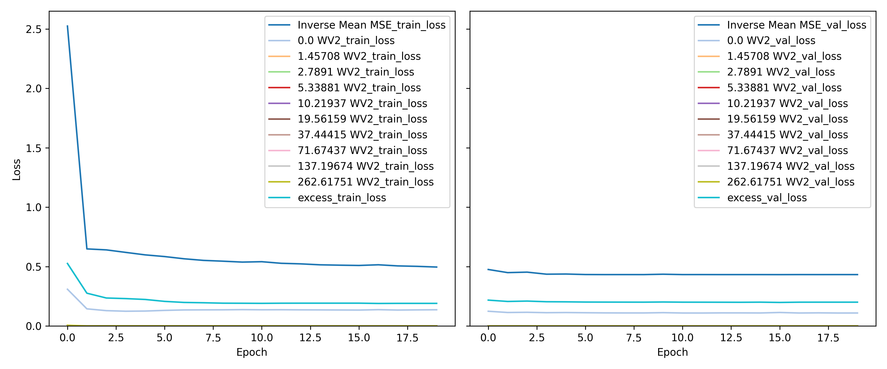

Estimating L4 Distribution Using I1 and I2
==========================================

# Objective


Estimate the L4 distribution using the I1 and I2 data - Very similar to creating the ToF data using Spatial PPG! - Held One Out  

# Comments


How to weight out the different losses is a big question. The network I have setup, forces the sum of all its outputs to be 1. Always. Which makes sense from a predicting PDF perspective. But also it means that we cannot scale the output labels. Since scaling would make the PDFs lose that add up to 1 property. One remedy to this is to scale the weight of each loss in the loss criterion. Specifically, here I set the weight to be inverse of the mean of each column(Including both training/validation). Note that the loss curves will show the unscaled losses! Whereas, the summation will take into account the weights. This makes it super easy to compare different weighing methods since ultimately we want to reduce the PDF unscaled MSE. Additional Note: My PDFs exclude l4 values beyond a certain threshold. So the data stored in the PDF pickles will not add up to 1. Slightly less in fact. So I manually add an excess column to account for this.  

# Data Length


515592  

# Model Used


```
=================================================================
Layer (type:depth-idx)                   Param #
=================================================================
PMFEstimatorNet                          --
├─Sequential: 1-1                        --
│    └─Linear: 2-1                       820
│    └─BatchNorm1d: 2-2                  40
│    └─ReLU: 2-3                         --
│    └─Linear: 2-4                       315
│    └─BatchNorm1d: 2-5                  30
│    └─ReLU: 2-6                         --
│    └─Linear: 2-7                       176
│    └─Flatten: 2-8                      --
│    └─Sigmoid: 2-9                      --
=================================================================
Total params: 1,381
Trainable params: 1,381
Non-trainable params: 0
=================================================================
```  

# Model Trainer Params


```

        Model Properties:
        PMFEstimatorNet(
  (model): Sequential(
    (0): Linear(in_features=40, out_features=20, bias=True)
    (1): BatchNorm1d(20, eps=1e-05, momentum=0.1, affine=True, track_running_stats=True)
    (2): ReLU()
    (3): Linear(in_features=20, out_features=15, bias=True)
    (4): BatchNorm1d(15, eps=1e-05, momentum=0.1, affine=True, track_running_stats=True)
    (5): ReLU()
    (6): Linear(in_features=15, out_features=11, bias=True)
    (7): Flatten(start_dim=1, end_dim=-1)
    (8): Sigmoid()
  )
)
        Data Loader Properties:
        515592 rows, 40 x columns, 11 y columns
        Batch Size: 1024
        X Columns: ['10_2.0_1', '15_2.0_1', '19_2.0_1', '24_2.0_1', '28_2.0_1', '33_2.0_1', '37_2.0_1', '41_2.0_1', '46_2.0_1', '50_2.0_1', '55_2.0_1', '59_2.0_1', '64_2.0_1', '68_2.0_1', '72_2.0_1', '77_2.0_1', '81_2.0_1', '86_2.0_1', '90_2.0_1', '94_2.0_1', '10_2.0_2', '15_2.0_2', '19_2.0_2', '24_2.0_2', '28_2.0_2', '33_2.0_2', '37_2.0_2', '41_2.0_2', '46_2.0_2', '50_2.0_2', '55_2.0_2', '59_2.0_2', '64_2.0_2', '68_2.0_2', '72_2.0_2', '77_2.0_2', '81_2.0_2', '86_2.0_2', '90_2.0_2', '94_2.0_2']
        Y Columns: ['0.0 WV2', '1.45708 WV2', '2.7891 WV2', '5.33881 WV2', '10.21937 WV2', '19.56159 WV2', '37.44415 WV2', '71.67437 WV2', '137.19674 WV2', '262.61751 WV2', 'excess']
        
        Validation Method:
        Holds out fMaternal Wall Thickness columns 19.0 for validation. The rest are used for training
        Loss Function:
        Sum of multiple loss functions.
        Constituent Losses: ['0.0 WV2', '1.45708 WV2', '2.7891 WV2', '5.33881 WV2', '10.21937 WV2', '19.56159 WV2', '37.44415 WV2', '71.67437 WV2', '137.19674 WV2', '262.61751 WV2', 'excess']
        Weights: [  1.36676647 192.3142604  116.48640368  78.2059869   56.51841864
  42.92115994  34.43726514  29.63347465  27.91095099  29.34986038
   1.07307547]
        Individual Loss Func Description:
        Torch Loss Function: MSELoss()
Torch Loss Function: MSELoss()
Torch Loss Function: MSELoss()
Torch Loss Function: MSELoss()
Torch Loss Function: MSELoss()
Torch Loss Function: MSELoss()
Torch Loss Function: MSELoss()
Torch Loss Function: MSELoss()
Torch Loss Function: MSELoss()
Torch Loss Function: MSELoss()
Torch Loss Function: MSELoss()
        
        Optimizer Properties":
        Adam (
Parameter Group 0
    amsgrad: False
    betas: (0.9, 0.999)
    capturable: False
    differentiable: False
    eps: 1e-08
    foreach: None
    fused: None
    lr: 0.001
    maximize: False
    weight_decay: 0
)
        
```  

# MSE Loss
  
<!DOCTYPE html>
<head>
<meta charset="UTF-8">
<style>
.r1 {font-style: italic}
.r2 {font-weight: bold}
.r3 {color: #008080; text-decoration-color: #008080}
.r4 {color: #800080; text-decoration-color: #800080}
.r5 {color: #008000; text-decoration-color: #008000}
body {
    color: #000000;
    background-color: #ffffff;
}
</style>
</head>
<html>
<body>
    <pre style="font-family:Menlo,'DejaVu Sans Mono',consolas,'Courier New',monospace"><code><span class="r1">                      Losses                       </span>
┏━━━━━━━━━━━━━━━━━━┳━━━━━━━━━━━━┳━━━━━━━━━━━━━━━━━┓
┃<span class="r2">        👀        </span>┃<span class="r2"> Train Loss </span>┃<span class="r2"> Validation Loss </span>┃
┡━━━━━━━━━━━━━━━━━━╇━━━━━━━━━━━━╇━━━━━━━━━━━━━━━━━┩
│<span class="r3"> Inverse Mean MSE </span>│<span class="r4">   0.4961   </span>│<span class="r5">     0.4327      </span>│
│<span class="r3">     0.0 WV2      </span>│<span class="r4">   0.1366   </span>│<span class="r5">     0.1093      </span>│
│<span class="r3">   1.45708 WV2    </span>│<span class="r4">   0.0000   </span>│<span class="r5">     0.0000      </span>│
│<span class="r3">    2.7891 WV2    </span>│<span class="r4">   0.0000   </span>│<span class="r5">     0.0000      </span>│
│<span class="r3">   5.33881 WV2    </span>│<span class="r4">   0.0001   </span>│<span class="r5">     0.0001      </span>│
│<span class="r3">   10.21937 WV2   </span>│<span class="r4">   0.0002   </span>│<span class="r5">     0.0001      </span>│
│<span class="r3">   19.56159 WV2   </span>│<span class="r4">   0.0003   </span>│<span class="r5">     0.0002      </span>│
│<span class="r3">   37.44415 WV2   </span>│<span class="r4">   0.0005   </span>│<span class="r5">     0.0003      </span>│
│<span class="r3">   71.67437 WV2   </span>│<span class="r4">   0.0006   </span>│<span class="r5">     0.0004      </span>│
│<span class="r3">  137.19674 WV2   </span>│<span class="r4">   0.0007   </span>│<span class="r5">     0.0004      </span>│
│<span class="r3">  262.61751 WV2   </span>│<span class="r4">   0.0006   </span>│<span class="r5">     0.0005      </span>│
│<span class="r3">      excess      </span>│<span class="r4">   0.1904   </span>│<span class="r5">     0.2005      </span>│
└──────────────────┴────────────┴─────────────────┘
</code></pre>
</body>
</html>

# Loss Curves
  
  
  
