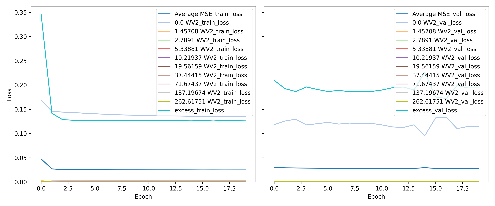

Estimating L4 Distribution Using I1 and I2
==========================================

# Objective


Estimate the L4 distribution using the I1 and I2 data - Very similar to creating the ToF data using Spatial PPG! - Held One Out  

# Comments


How to weight out the different losses is a big question. Same as l4estimation1. But instead of using that inverse mean for loss weighting, I am just using a constant 1/len(y_columns). i.e, equal weight to all losses. but averaged out  

# Data Length


515592  

# Model Used


```
=================================================================
Layer (type:depth-idx)                   Param #
=================================================================
PMFEstimatorNet                          --
├─Sequential: 1-1                        --
│    └─Linear: 2-1                       820
│    └─BatchNorm1d: 2-2                  40
│    └─ReLU: 2-3                         --
│    └─Linear: 2-4                       315
│    └─BatchNorm1d: 2-5                  30
│    └─ReLU: 2-6                         --
│    └─Linear: 2-7                       176
│    └─Flatten: 2-8                      --
│    └─Sigmoid: 2-9                      --
=================================================================
Total params: 1,381
Trainable params: 1,381
Non-trainable params: 0
=================================================================
```  

# Model Trainer Params


```

        Model Properties:
        PMFEstimatorNet(
  (model): Sequential(
    (0): Linear(in_features=40, out_features=20, bias=True)
    (1): BatchNorm1d(20, eps=1e-05, momentum=0.1, affine=True, track_running_stats=True)
    (2): ReLU()
    (3): Linear(in_features=20, out_features=15, bias=True)
    (4): BatchNorm1d(15, eps=1e-05, momentum=0.1, affine=True, track_running_stats=True)
    (5): ReLU()
    (6): Linear(in_features=15, out_features=11, bias=True)
    (7): Flatten(start_dim=1, end_dim=-1)
    (8): Sigmoid()
  )
)
        Data Loader Properties:
        515592 rows, 40 x columns, 11 y columns
        Batch Size: 1024
        X Columns: ['10_2.0_1', '15_2.0_1', '19_2.0_1', '24_2.0_1', '28_2.0_1', '33_2.0_1', '37_2.0_1', '41_2.0_1', '46_2.0_1', '50_2.0_1', '55_2.0_1', '59_2.0_1', '64_2.0_1', '68_2.0_1', '72_2.0_1', '77_2.0_1', '81_2.0_1', '86_2.0_1', '90_2.0_1', '94_2.0_1', '10_2.0_2', '15_2.0_2', '19_2.0_2', '24_2.0_2', '28_2.0_2', '33_2.0_2', '37_2.0_2', '41_2.0_2', '46_2.0_2', '50_2.0_2', '55_2.0_2', '59_2.0_2', '64_2.0_2', '68_2.0_2', '72_2.0_2', '77_2.0_2', '81_2.0_2', '86_2.0_2', '90_2.0_2', '94_2.0_2']
        Y Columns: ['0.0 WV2', '1.45708 WV2', '2.7891 WV2', '5.33881 WV2', '10.21937 WV2', '19.56159 WV2', '37.44415 WV2', '71.67437 WV2', '137.19674 WV2', '262.61751 WV2', 'excess']
        
        Validation Method:
        Holds out fMaternal Wall Thickness columns 19.0 for validation. The rest are used for training
        Loss Function:
        Sum of multiple loss functions.
        Constituent Losses: ['0.0 WV2', '1.45708 WV2', '2.7891 WV2', '5.33881 WV2', '10.21937 WV2', '19.56159 WV2', '37.44415 WV2', '71.67437 WV2', '137.19674 WV2', '262.61751 WV2', 'excess']
        Weights: [0.09090909090909091, 0.09090909090909091, 0.09090909090909091, 0.09090909090909091, 0.09090909090909091, 0.09090909090909091, 0.09090909090909091, 0.09090909090909091, 0.09090909090909091, 0.09090909090909091, 0.09090909090909091]
        Individual Loss Func Description:
        Torch Loss Function: MSELoss()
Torch Loss Function: MSELoss()
Torch Loss Function: MSELoss()
Torch Loss Function: MSELoss()
Torch Loss Function: MSELoss()
Torch Loss Function: MSELoss()
Torch Loss Function: MSELoss()
Torch Loss Function: MSELoss()
Torch Loss Function: MSELoss()
Torch Loss Function: MSELoss()
Torch Loss Function: MSELoss()
        
        Optimizer Properties":
        Adam (
Parameter Group 0
    amsgrad: False
    betas: (0.9, 0.999)
    capturable: False
    differentiable: False
    eps: 1e-08
    foreach: None
    fused: None
    lr: 0.001
    maximize: False
    weight_decay: 0
)
        
```  

# MSE Loss
  
<!DOCTYPE html>
<head>
<meta charset="UTF-8">
<style>
.r1 {font-style: italic}
.r2 {font-weight: bold}
.r3 {color: #008080; text-decoration-color: #008080}
.r4 {color: #800080; text-decoration-color: #800080}
.r5 {color: #008000; text-decoration-color: #008000}
body {
    color: #000000;
    background-color: #ffffff;
}
</style>
</head>
<html>
<body>
    <pre style="font-family:Menlo,'DejaVu Sans Mono',consolas,'Courier New',monospace"><code><span class="r1">                     Losses                     </span>
┏━━━━━━━━━━━━━━━┳━━━━━━━━━━━━┳━━━━━━━━━━━━━━━━━┓
┃<span class="r2">      👀       </span>┃<span class="r2"> Train Loss </span>┃<span class="r2"> Validation Loss </span>┃
┡━━━━━━━━━━━━━━━╇━━━━━━━━━━━━╇━━━━━━━━━━━━━━━━━┩
│<span class="r3">  Average MSE  </span>│<span class="r4">   0.0248   </span>│<span class="r5">     0.0282      </span>│
│<span class="r3">    0.0 WV2    </span>│<span class="r4">   0.1349   </span>│<span class="r5">     0.1147      </span>│
│<span class="r3">  1.45708 WV2  </span>│<span class="r4">   0.0001   </span>│<span class="r5">     0.0000      </span>│
│<span class="r3">  2.7891 WV2   </span>│<span class="r4">   0.0001   </span>│<span class="r5">     0.0000      </span>│
│<span class="r3">  5.33881 WV2  </span>│<span class="r4">   0.0003   </span>│<span class="r5">     0.0001      </span>│
│<span class="r3"> 10.21937 WV2  </span>│<span class="r4">   0.0006   </span>│<span class="r5">     0.0001      </span>│
│<span class="r3"> 19.56159 WV2  </span>│<span class="r4">   0.0011   </span>│<span class="r5">     0.0002      </span>│
│<span class="r3"> 37.44415 WV2  </span>│<span class="r4">   0.0017   </span>│<span class="r5">     0.0003      </span>│
│<span class="r3"> 71.67437 WV2  </span>│<span class="r4">   0.0023   </span>│<span class="r5">     0.0004      </span>│
│<span class="r3"> 137.19674 WV2 </span>│<span class="r4">   0.0025   </span>│<span class="r5">     0.0005      </span>│
│<span class="r3"> 262.61751 WV2 </span>│<span class="r4">   0.0021   </span>│<span class="r5">     0.0005      </span>│
│<span class="r3">    excess     </span>│<span class="r4">   0.1277   </span>│<span class="r5">     0.1940      </span>│
└───────────────┴────────────┴─────────────────┘
</code></pre>
</body>
</html>

# Loss Curves
  
  
  
