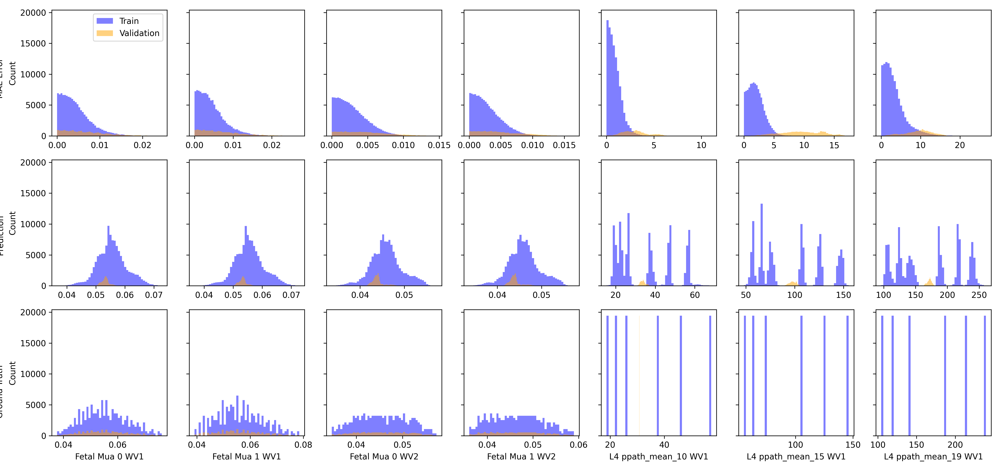

Model Tuning When Using Physics Losses
======================================

# Comment


Fatter Models tend to give better performance compared to long thinner models  

# Model Used


```
=================================================================
Layer (type:depth-idx)                   Param #
=================================================================
PerceptronBD                             --
├─Sequential: 1-1                        --
│    └─Linear: 2-1                       4,100
│    └─BatchNorm1d: 2-2                  200
│    └─ReLU: 2-3                         --
│    └─Linear: 2-4                       6,060
│    └─BatchNorm1d: 2-5                  120
│    └─ReLU: 2-6                         --
│    └─Linear: 2-7                       2,684
│    └─Flatten: 2-8                      --
=================================================================
Total params: 13,164
Trainable params: 13,164
Non-trainable params: 0
=================================================================
```  

# Unnormalized Errors


```
       Fetal Mua 0 WV1 Error  Fetal Mua 1 WV1 Error  Fetal Mua 0 WV2 Error  \
count           1.166400e+05           1.166400e+05           1.166400e+05   
mean            4.390594e-03           4.463538e-03           2.864170e-03   
std             3.354797e-03           3.468552e-03           2.093039e-03   
min             1.080248e-09           1.536077e-07           9.262902e-09   
25%             1.787128e-03           1.801406e-03           1.181767e-03   
50%             3.701834e-03           3.716683e-03           2.470693e-03   
75%             6.194540e-03           6.257954e-03           4.132079e-03   
max             2.078665e-02           2.252236e-02           1.257233e-02   

       Fetal Mua 1 WV2 Error  
count           1.166400e+05  
mean            2.906927e-03  
std             2.169997e-03  
min             7.689907e-08  
25%             1.180878e-03  
50%             2.468981e-03  
75%             4.187970e-03  
max             1.376696e-02  

       Fetal Mua 0 WV1 Error  Fetal Mua 1 WV1 Error  Fetal Mua 0 WV2 Error  \
count           1.944000e+04           1.944000e+04           1.944000e+04   
mean            6.700386e-03           7.009600e-03           4.707617e-03   
std             4.930737e-03           5.297840e-03           3.166409e-03   
min             2.906627e-07           4.952352e-07           1.716670e-07   
25%             2.688535e-03           2.724339e-03           2.080418e-03   
50%             5.701053e-03           5.960491e-03           4.276605e-03   
75%             9.761905e-03           1.019091e-02           6.826256e-03   
max             2.453707e-02           2.708382e-02           1.462695e-02   

       Fetal Mua 1 WV2 Error  
count           1.944000e+04  
mean            4.961240e-03  
std             3.443158e-03  
min             7.425826e-07  
25%             2.159100e-03  
50%             4.332867e-03  
75%             7.330713e-03  
max             1.652169e-02  
```  

# Loss


Label Loss(training): 0.054015033808945304,
                       Label loss(validation): 0.14148474489583782  

# Model Trainer Params


```

        Model Properties:
        PerceptronBD(
  (model): Sequential(
    (0): Linear(in_features=40, out_features=100, bias=True)
    (1): BatchNorm1d(100, eps=1e-05, momentum=0.1, affine=True, track_running_stats=True)
    (2): ReLU()
    (3): Linear(in_features=100, out_features=60, bias=True)
    (4): BatchNorm1d(60, eps=1e-05, momentum=0.1, affine=True, track_running_stats=True)
    (5): ReLU()
    (6): Linear(in_features=60, out_features=44, bias=True)
    (7): Flatten(start_dim=1, end_dim=-1)
  )
)
        Data Loader Properties:
        136080 rows, 40 x columns, 44 y columns
        Batch Size: 128
        X Columns: ['MAX_ACbyDC_WV1_0', 'MAX_ACbyDC_WV1_1', 'MAX_ACbyDC_WV1_2', 'MAX_ACbyDC_WV1_3', 'MAX_ACbyDC_WV1_4', 'MAX_ACbyDC_WV1_5', 'MAX_ACbyDC_WV1_6', 'MAX_ACbyDC_WV1_7', 'MAX_ACbyDC_WV1_8', 'MAX_ACbyDC_WV1_9', 'MAX_ACbyDC_WV1_10', 'MAX_ACbyDC_WV1_11', 'MAX_ACbyDC_WV1_12', 'MAX_ACbyDC_WV1_13', 'MAX_ACbyDC_WV1_14', 'MAX_ACbyDC_WV1_15', 'MAX_ACbyDC_WV1_16', 'MAX_ACbyDC_WV1_17', 'MAX_ACbyDC_WV1_18', 'MAX_ACbyDC_WV1_19', 'MAX_ACbyDC_WV2_0', 'MAX_ACbyDC_WV2_1', 'MAX_ACbyDC_WV2_2', 'MAX_ACbyDC_WV2_3', 'MAX_ACbyDC_WV2_4', 'MAX_ACbyDC_WV2_5', 'MAX_ACbyDC_WV2_6', 'MAX_ACbyDC_WV2_7', 'MAX_ACbyDC_WV2_8', 'MAX_ACbyDC_WV2_9', 'MAX_ACbyDC_WV2_10', 'MAX_ACbyDC_WV2_11', 'MAX_ACbyDC_WV2_12', 'MAX_ACbyDC_WV2_13', 'MAX_ACbyDC_WV2_14', 'MAX_ACbyDC_WV2_15', 'MAX_ACbyDC_WV2_16', 'MAX_ACbyDC_WV2_17', 'MAX_ACbyDC_WV2_18', 'MAX_ACbyDC_WV2_19']
        Y Columns: ['Fetal Mua 0 WV1', 'Fetal Mua 1 WV1', 'Fetal Mua 0 WV2', 'Fetal Mua 1 WV2', 'L4 ppath_mean_10 WV1', 'L4 ppath_mean_15 WV1', 'L4 ppath_mean_19 WV1', 'L4 ppath_mean_24 WV1', 'L4 ppath_mean_28 WV1', 'L4 ppath_mean_33 WV1', 'L4 ppath_mean_37 WV1', 'L4 ppath_mean_41 WV1', 'L4 ppath_mean_46 WV1', 'L4 ppath_mean_50 WV1', 'L4 ppath_mean_55 WV1', 'L4 ppath_mean_59 WV1', 'L4 ppath_mean_64 WV1', 'L4 ppath_mean_68 WV1', 'L4 ppath_mean_72 WV1', 'L4 ppath_mean_77 WV1', 'L4 ppath_mean_81 WV1', 'L4 ppath_mean_86 WV1', 'L4 ppath_mean_90 WV1', 'L4 ppath_mean_94 WV1', 'L4 ppath_mean_10 WV2', 'L4 ppath_mean_15 WV2', 'L4 ppath_mean_19 WV2', 'L4 ppath_mean_24 WV2', 'L4 ppath_mean_28 WV2', 'L4 ppath_mean_33 WV2', 'L4 ppath_mean_37 WV2', 'L4 ppath_mean_41 WV2', 'L4 ppath_mean_46 WV2', 'L4 ppath_mean_50 WV2', 'L4 ppath_mean_55 WV2', 'L4 ppath_mean_59 WV2', 'L4 ppath_mean_64 WV2', 'L4 ppath_mean_68 WV2', 'L4 ppath_mean_72 WV2', 'L4 ppath_mean_77 WV2', 'L4 ppath_mean_81 WV2', 'L4 ppath_mean_86 WV2', 'L4 ppath_mean_90 WV2', 'L4 ppath_mean_94 WV2']
        Extra Columns: ['MAX_ACbyDC_WV1_0 unscaled', 'MAX_ACbyDC_WV1_1 unscaled', 'MAX_ACbyDC_WV1_2 unscaled', 'MAX_ACbyDC_WV1_3 unscaled', 'MAX_ACbyDC_WV1_4 unscaled', 'MAX_ACbyDC_WV1_5 unscaled', 'MAX_ACbyDC_WV1_6 unscaled', 'MAX_ACbyDC_WV1_7 unscaled', 'MAX_ACbyDC_WV1_8 unscaled', 'MAX_ACbyDC_WV1_9 unscaled', 'MAX_ACbyDC_WV1_10 unscaled', 'MAX_ACbyDC_WV1_11 unscaled', 'MAX_ACbyDC_WV1_12 unscaled', 'MAX_ACbyDC_WV1_13 unscaled', 'MAX_ACbyDC_WV1_14 unscaled', 'MAX_ACbyDC_WV1_15 unscaled', 'MAX_ACbyDC_WV1_16 unscaled', 'MAX_ACbyDC_WV1_17 unscaled', 'MAX_ACbyDC_WV1_18 unscaled', 'MAX_ACbyDC_WV1_19 unscaled', 'MAX_ACbyDC_WV2_0 unscaled', 'MAX_ACbyDC_WV2_1 unscaled', 'MAX_ACbyDC_WV2_2 unscaled', 'MAX_ACbyDC_WV2_3 unscaled', 'MAX_ACbyDC_WV2_4 unscaled', 'MAX_ACbyDC_WV2_5 unscaled', 'MAX_ACbyDC_WV2_6 unscaled', 'MAX_ACbyDC_WV2_7 unscaled', 'MAX_ACbyDC_WV2_8 unscaled', 'MAX_ACbyDC_WV2_9 unscaled', 'MAX_ACbyDC_WV2_10 unscaled', 'MAX_ACbyDC_WV2_11 unscaled', 'MAX_ACbyDC_WV2_12 unscaled', 'MAX_ACbyDC_WV2_13 unscaled', 'MAX_ACbyDC_WV2_14 unscaled', 'MAX_ACbyDC_WV2_15 unscaled', 'MAX_ACbyDC_WV2_16 unscaled', 'MAX_ACbyDC_WV2_17 unscaled', 'MAX_ACbyDC_WV2_18 unscaled', 'MAX_ACbyDC_WV2_19 unscaled']
        Validation Method:
        Holds out fMaternal Wall Thickness columns 10.0 for validation. The rest are used for training
        Loss Function:
        Sum of multiple loss functions. 
        Constituent Losses: ['label_loss', 'physics_loss_wv1', 'physics_loss_wv2']
        Weights: [1.0, 0.8, 0.8]
        Individual Loss Func Description:
        Torch Loss Function: MSELoss()
Beer-Lamberts Law based Physics loss comparing the predicted pulsation ratio to the ground truth(using the pathlengths and mu_a values)
Beer-Lamberts Law based Physics loss comparing the predicted pulsation ratio to the ground truth(using the pathlengths and mu_a values)
        
        Optimizer Properties":
        SGD (
Parameter Group 0
    dampening: 0
    differentiable: False
    foreach: None
    lr: 0.0002
    maximize: False
    momentum: 0.89
    nesterov: False
    weight_decay: 0.0001
)
        
```  

# Loss Curves
  
  
  

# Prediction & Error Distribution
  
  
  
