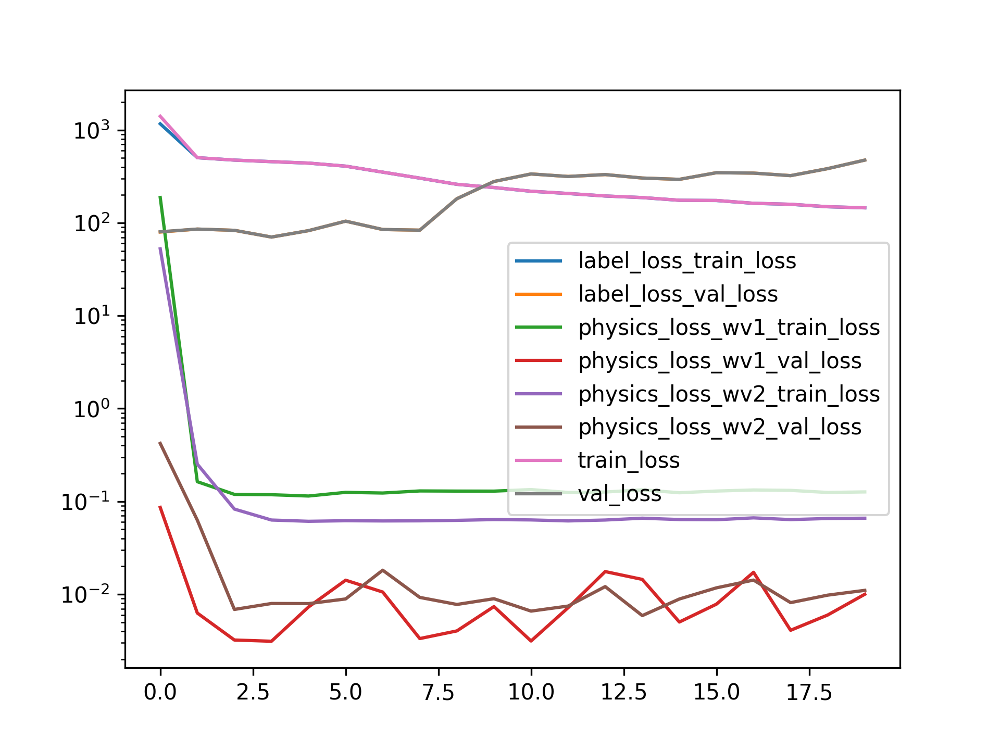
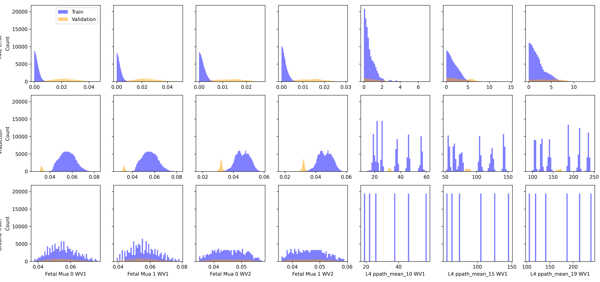

Model Tuning When Using Physics Losses
======================================

# Comment


As long as the physics losses provide some sort of gradinets to the loss, the model does not overfit. The moment the phyics losses are low, it starts to overfit. This is a good thing!  

# Model Used


```
=================================================================
Layer (type:depth-idx)                   Param #
=================================================================
PerceptronBD                             --
├─Sequential: 1-1                        --
│    └─Linear: 2-1                       3,280
│    └─BatchNorm1d: 2-2                  160
│    └─ReLU: 2-3                         --
│    └─Linear: 2-4                       4,860
│    └─BatchNorm1d: 2-5                  120
│    └─ReLU: 2-6                         --
│    └─Linear: 2-7                       2,684
│    └─Flatten: 2-8                      --
=================================================================
Total params: 11,104
Trainable params: 11,104
Non-trainable params: 0
=================================================================
```  

# Unnormalized Errors


```
       Fetal Mua 0 WV1 Error  Fetal Mua 1 WV1 Error  Fetal Mua 0 WV2 Error  \
count           1.166400e+05           1.166400e+05           1.166400e+05   
mean            2.096943e-03           2.164358e-03           1.591761e-03   
std             1.659431e-03           1.727918e-03           1.259192e-03   
min             9.591383e-08           4.837645e-08           1.617974e-08   
25%             8.068888e-04           8.211102e-04           6.084106e-04   
50%             1.721418e-03           1.762466e-03           1.302828e-03   
75%             2.991094e-03           3.096289e-03           2.280044e-03   
max             1.192880e-02           1.138945e-02           8.630994e-03   

       Fetal Mua 1 WV2 Error  
count           1.166400e+05  
mean            1.632615e-03  
std             1.347732e-03  
min             2.657419e-08  
25%             5.991355e-04  
50%             1.294205e-03  
75%             2.321500e-03  
max             1.027752e-02  

       Fetal Mua 0 WV1 Error  Fetal Mua 1 WV1 Error  Fetal Mua 0 WV2 Error  \
count           19440.000000           19440.000000           19440.000000   
mean                0.022522               0.023576               0.013655   
std                 0.008487               0.008682               0.005111   
min                 0.001851               0.003250               0.002405   
25%                 0.016353               0.017261               0.009560   
50%                 0.022206               0.023096               0.013669   
75%                 0.028457               0.029539               0.017379   
max                 0.045984               0.049536               0.026585   

       Fetal Mua 1 WV2 Error  
count           19440.000000  
mean                0.014537  
std                 0.005290  
min                 0.003747  
25%                 0.010267  
50%                 0.014563  
75%                 0.018094  
max                 0.029270  
```  

# Loss


Label Loss(training): 0.03984151422946787,
                       Label loss(validation): 0.7803100917096201  

# Model Trainer Params


```

        Model Properties:
        PerceptronBD(
  (model): Sequential(
    (0): Linear(in_features=40, out_features=80, bias=True)
    (1): BatchNorm1d(80, eps=1e-05, momentum=0.1, affine=True, track_running_stats=True)
    (2): ReLU()
    (3): Linear(in_features=80, out_features=60, bias=True)
    (4): BatchNorm1d(60, eps=1e-05, momentum=0.1, affine=True, track_running_stats=True)
    (5): ReLU()
    (6): Linear(in_features=60, out_features=44, bias=True)
    (7): Flatten(start_dim=1, end_dim=-1)
  )
)
        Data Loader Properties:
        136080 rows, 40 x columns, 44 y columns
        Batch Size: 32
        X Columns: ['MAX_ACbyDC_WV1_0', 'MAX_ACbyDC_WV1_1', 'MAX_ACbyDC_WV1_2', 'MAX_ACbyDC_WV1_3', 'MAX_ACbyDC_WV1_4', 'MAX_ACbyDC_WV1_5', 'MAX_ACbyDC_WV1_6', 'MAX_ACbyDC_WV1_7', 'MAX_ACbyDC_WV1_8', 'MAX_ACbyDC_WV1_9', 'MAX_ACbyDC_WV1_10', 'MAX_ACbyDC_WV1_11', 'MAX_ACbyDC_WV1_12', 'MAX_ACbyDC_WV1_13', 'MAX_ACbyDC_WV1_14', 'MAX_ACbyDC_WV1_15', 'MAX_ACbyDC_WV1_16', 'MAX_ACbyDC_WV1_17', 'MAX_ACbyDC_WV1_18', 'MAX_ACbyDC_WV1_19', 'MAX_ACbyDC_WV2_0', 'MAX_ACbyDC_WV2_1', 'MAX_ACbyDC_WV2_2', 'MAX_ACbyDC_WV2_3', 'MAX_ACbyDC_WV2_4', 'MAX_ACbyDC_WV2_5', 'MAX_ACbyDC_WV2_6', 'MAX_ACbyDC_WV2_7', 'MAX_ACbyDC_WV2_8', 'MAX_ACbyDC_WV2_9', 'MAX_ACbyDC_WV2_10', 'MAX_ACbyDC_WV2_11', 'MAX_ACbyDC_WV2_12', 'MAX_ACbyDC_WV2_13', 'MAX_ACbyDC_WV2_14', 'MAX_ACbyDC_WV2_15', 'MAX_ACbyDC_WV2_16', 'MAX_ACbyDC_WV2_17', 'MAX_ACbyDC_WV2_18', 'MAX_ACbyDC_WV2_19']
        Y Columns: ['Fetal Mua 0 WV1', 'Fetal Mua 1 WV1', 'Fetal Mua 0 WV2', 'Fetal Mua 1 WV2', 'L4 ppath_mean_10 WV1', 'L4 ppath_mean_15 WV1', 'L4 ppath_mean_19 WV1', 'L4 ppath_mean_24 WV1', 'L4 ppath_mean_28 WV1', 'L4 ppath_mean_33 WV1', 'L4 ppath_mean_37 WV1', 'L4 ppath_mean_41 WV1', 'L4 ppath_mean_46 WV1', 'L4 ppath_mean_50 WV1', 'L4 ppath_mean_55 WV1', 'L4 ppath_mean_59 WV1', 'L4 ppath_mean_64 WV1', 'L4 ppath_mean_68 WV1', 'L4 ppath_mean_72 WV1', 'L4 ppath_mean_77 WV1', 'L4 ppath_mean_81 WV1', 'L4 ppath_mean_86 WV1', 'L4 ppath_mean_90 WV1', 'L4 ppath_mean_94 WV1', 'L4 ppath_mean_10 WV2', 'L4 ppath_mean_15 WV2', 'L4 ppath_mean_19 WV2', 'L4 ppath_mean_24 WV2', 'L4 ppath_mean_28 WV2', 'L4 ppath_mean_33 WV2', 'L4 ppath_mean_37 WV2', 'L4 ppath_mean_41 WV2', 'L4 ppath_mean_46 WV2', 'L4 ppath_mean_50 WV2', 'L4 ppath_mean_55 WV2', 'L4 ppath_mean_59 WV2', 'L4 ppath_mean_64 WV2', 'L4 ppath_mean_68 WV2', 'L4 ppath_mean_72 WV2', 'L4 ppath_mean_77 WV2', 'L4 ppath_mean_81 WV2', 'L4 ppath_mean_86 WV2', 'L4 ppath_mean_90 WV2', 'L4 ppath_mean_94 WV2']
        Extra Columns: ['MAX_ACbyDC_WV1_0 unscaled', 'MAX_ACbyDC_WV1_1 unscaled', 'MAX_ACbyDC_WV1_2 unscaled', 'MAX_ACbyDC_WV1_3 unscaled', 'MAX_ACbyDC_WV1_4 unscaled', 'MAX_ACbyDC_WV1_5 unscaled', 'MAX_ACbyDC_WV1_6 unscaled', 'MAX_ACbyDC_WV1_7 unscaled', 'MAX_ACbyDC_WV1_8 unscaled', 'MAX_ACbyDC_WV1_9 unscaled', 'MAX_ACbyDC_WV1_10 unscaled', 'MAX_ACbyDC_WV1_11 unscaled', 'MAX_ACbyDC_WV1_12 unscaled', 'MAX_ACbyDC_WV1_13 unscaled', 'MAX_ACbyDC_WV1_14 unscaled', 'MAX_ACbyDC_WV1_15 unscaled', 'MAX_ACbyDC_WV1_16 unscaled', 'MAX_ACbyDC_WV1_17 unscaled', 'MAX_ACbyDC_WV1_18 unscaled', 'MAX_ACbyDC_WV1_19 unscaled', 'MAX_ACbyDC_WV2_0 unscaled', 'MAX_ACbyDC_WV2_1 unscaled', 'MAX_ACbyDC_WV2_2 unscaled', 'MAX_ACbyDC_WV2_3 unscaled', 'MAX_ACbyDC_WV2_4 unscaled', 'MAX_ACbyDC_WV2_5 unscaled', 'MAX_ACbyDC_WV2_6 unscaled', 'MAX_ACbyDC_WV2_7 unscaled', 'MAX_ACbyDC_WV2_8 unscaled', 'MAX_ACbyDC_WV2_9 unscaled', 'MAX_ACbyDC_WV2_10 unscaled', 'MAX_ACbyDC_WV2_11 unscaled', 'MAX_ACbyDC_WV2_12 unscaled', 'MAX_ACbyDC_WV2_13 unscaled', 'MAX_ACbyDC_WV2_14 unscaled', 'MAX_ACbyDC_WV2_15 unscaled', 'MAX_ACbyDC_WV2_16 unscaled', 'MAX_ACbyDC_WV2_17 unscaled', 'MAX_ACbyDC_WV2_18 unscaled', 'MAX_ACbyDC_WV2_19 unscaled']
        Validation Method:
        Holds out fMaternal Wall Thickness columns 10.0 for validation. The rest are used for training
        Loss Function:
        Sum of multiple loss functions. 
        Constituent Losses: ['label_loss', 'physics_loss_wv1', 'physics_loss_wv2']
        Weights: [1.0, 0.8, 0.8]
        Individual Loss Func Description:
        Torch Loss Function: MSELoss()
Beer-Lamberts Law based Physics loss comparing the predicted pulsation ratio to the ground truth(using the pathlengths and mu_a values)
Beer-Lamberts Law based Physics loss comparing the predicted pulsation ratio to the ground truth(using the pathlengths and mu_a values)
        
        Optimizer Properties":
        SGD (
Parameter Group 0
    dampening: 0
    differentiable: False
    foreach: None
    lr: 0.0002
    maximize: False
    momentum: 0.95
    nesterov: False
    weight_decay: 0.0001
)
        
```  

# Loss Curves
  
  
  

# Prediction & Error Distribution
  
  
  
