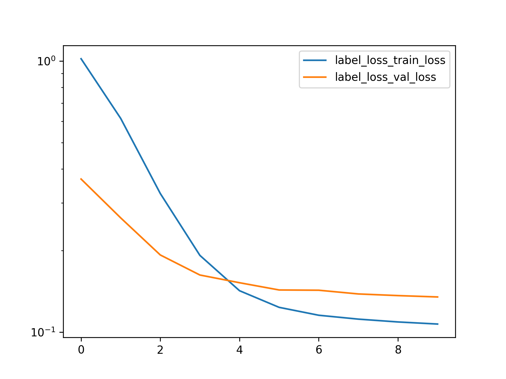
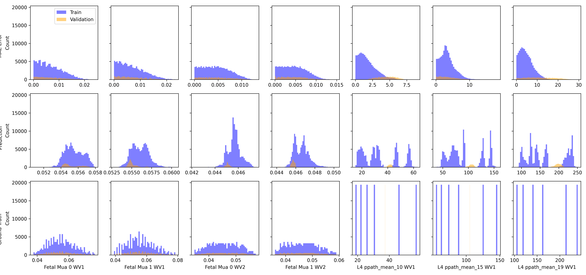

Held One Out Validation Style with No Physics Loss
==================================================

# Comment


With some tuning, you actually can get comparable or even better losses compared to the with-physics loss.  

# Model Used


```
=================================================================
Layer (type:depth-idx)                   Param #
=================================================================
PerceptronBD                             --
├─Sequential: 1-1                        --
│    └─Linear: 2-1                       3,280
│    └─BatchNorm1d: 2-2                  160
│    └─ReLU: 2-3                         --
│    └─Linear: 2-4                       4,050
│    └─BatchNorm1d: 2-5                  100
│    └─ReLU: 2-6                         --
│    └─Linear: 2-7                       2,244
│    └─Flatten: 2-8                      --
=================================================================
Total params: 9,834
Trainable params: 9,834
Non-trainable params: 0
=================================================================
```  

# Unnormalized Errors


```
       Fetal Mua 0 WV1 Error  Fetal Mua 1 WV1 Error  Fetal Mua 0 WV2 Error  \
count           1.166400e+05           1.166400e+05           1.166400e+05   
mean            6.707739e-03           6.756018e-03           4.547113e-03   
std             4.712128e-03           4.812972e-03           2.809559e-03   
min             2.677797e-09           4.201769e-08           4.148081e-08   
25%             2.736120e-03           2.736668e-03           2.206120e-03   
50%             5.951907e-03           5.963170e-03           4.362920e-03   
75%             9.940861e-03           9.999276e-03           6.630354e-03   
max             2.406514e-02           2.321845e-02           1.299939e-02   

       Fetal Mua 1 WV2 Error  
count           1.166400e+05  
mean            4.622969e-03  
std             2.878684e-03  
min             1.460335e-07  
25%             2.216842e-03  
50%             4.437604e-03  
75%             6.740079e-03  
max             1.359748e-02  

       Fetal Mua 0 WV1 Error  Fetal Mua 1 WV1 Error  Fetal Mua 0 WV2 Error  \
count           1.944000e+04           1.944000e+04           19440.000000   
mean            6.634945e-03           6.815363e-03               0.004623   
std             4.718967e-03           4.936468e-03               0.002928   
min             3.462879e-08           1.517375e-07               0.000001   
25%             2.676573e-03           2.825894e-03               0.002169   
50%             5.870094e-03           5.874787e-03               0.004386   
75%             9.911718e-03           1.007779e-02               0.006822   
max             2.020810e-02           2.331717e-02               0.012333   

       Fetal Mua 1 WV2 Error  
count           19440.000000  
mean                0.004744  
std                 0.003102  
min                 0.000002  
25%                 0.002203  
50%                 0.004438  
75%                 0.006728  
max                 0.014922  
```  

# Loss


Label Loss(training): 0.10714737149445634,
                       Label loss(validation): 0.13486148848345406  

# Model Trainer Params


```

        Model Properties:
        PerceptronBD(
  (model): Sequential(
    (0): Linear(in_features=40, out_features=80, bias=True)
    (1): BatchNorm1d(80, eps=1e-05, momentum=0.1, affine=True, track_running_stats=True)
    (2): ReLU()
    (3): Linear(in_features=80, out_features=50, bias=True)
    (4): BatchNorm1d(50, eps=1e-05, momentum=0.1, affine=True, track_running_stats=True)
    (5): ReLU()
    (6): Linear(in_features=50, out_features=44, bias=True)
    (7): Flatten(start_dim=1, end_dim=-1)
  )
)
        Data Loader Properties:
        136080 rows, 40 x columns, 44 y columns
        Batch Size: 512
        X Columns: ['MAX_ACbyDC_WV1_0', 'MAX_ACbyDC_WV1_1', 'MAX_ACbyDC_WV1_2', 'MAX_ACbyDC_WV1_3', 'MAX_ACbyDC_WV1_4', 'MAX_ACbyDC_WV1_5', 'MAX_ACbyDC_WV1_6', 'MAX_ACbyDC_WV1_7', 'MAX_ACbyDC_WV1_8', 'MAX_ACbyDC_WV1_9', 'MAX_ACbyDC_WV1_10', 'MAX_ACbyDC_WV1_11', 'MAX_ACbyDC_WV1_12', 'MAX_ACbyDC_WV1_13', 'MAX_ACbyDC_WV1_14', 'MAX_ACbyDC_WV1_15', 'MAX_ACbyDC_WV1_16', 'MAX_ACbyDC_WV1_17', 'MAX_ACbyDC_WV1_18', 'MAX_ACbyDC_WV1_19', 'MAX_ACbyDC_WV2_0', 'MAX_ACbyDC_WV2_1', 'MAX_ACbyDC_WV2_2', 'MAX_ACbyDC_WV2_3', 'MAX_ACbyDC_WV2_4', 'MAX_ACbyDC_WV2_5', 'MAX_ACbyDC_WV2_6', 'MAX_ACbyDC_WV2_7', 'MAX_ACbyDC_WV2_8', 'MAX_ACbyDC_WV2_9', 'MAX_ACbyDC_WV2_10', 'MAX_ACbyDC_WV2_11', 'MAX_ACbyDC_WV2_12', 'MAX_ACbyDC_WV2_13', 'MAX_ACbyDC_WV2_14', 'MAX_ACbyDC_WV2_15', 'MAX_ACbyDC_WV2_16', 'MAX_ACbyDC_WV2_17', 'MAX_ACbyDC_WV2_18', 'MAX_ACbyDC_WV2_19']
        Y Columns: ['Fetal Mua 0 WV1', 'Fetal Mua 1 WV1', 'Fetal Mua 0 WV2', 'Fetal Mua 1 WV2', 'L4 ppath_mean_10 WV1', 'L4 ppath_mean_15 WV1', 'L4 ppath_mean_19 WV1', 'L4 ppath_mean_24 WV1', 'L4 ppath_mean_28 WV1', 'L4 ppath_mean_33 WV1', 'L4 ppath_mean_37 WV1', 'L4 ppath_mean_41 WV1', 'L4 ppath_mean_46 WV1', 'L4 ppath_mean_50 WV1', 'L4 ppath_mean_55 WV1', 'L4 ppath_mean_59 WV1', 'L4 ppath_mean_64 WV1', 'L4 ppath_mean_68 WV1', 'L4 ppath_mean_72 WV1', 'L4 ppath_mean_77 WV1', 'L4 ppath_mean_81 WV1', 'L4 ppath_mean_86 WV1', 'L4 ppath_mean_90 WV1', 'L4 ppath_mean_94 WV1', 'L4 ppath_mean_10 WV2', 'L4 ppath_mean_15 WV2', 'L4 ppath_mean_19 WV2', 'L4 ppath_mean_24 WV2', 'L4 ppath_mean_28 WV2', 'L4 ppath_mean_33 WV2', 'L4 ppath_mean_37 WV2', 'L4 ppath_mean_41 WV2', 'L4 ppath_mean_46 WV2', 'L4 ppath_mean_50 WV2', 'L4 ppath_mean_55 WV2', 'L4 ppath_mean_59 WV2', 'L4 ppath_mean_64 WV2', 'L4 ppath_mean_68 WV2', 'L4 ppath_mean_72 WV2', 'L4 ppath_mean_77 WV2', 'L4 ppath_mean_81 WV2', 'L4 ppath_mean_86 WV2', 'L4 ppath_mean_90 WV2', 'L4 ppath_mean_94 WV2']
        Extra Columns: ['MAX_ACbyDC_WV1_0 unscaled', 'MAX_ACbyDC_WV1_1 unscaled', 'MAX_ACbyDC_WV1_2 unscaled', 'MAX_ACbyDC_WV1_3 unscaled', 'MAX_ACbyDC_WV1_4 unscaled', 'MAX_ACbyDC_WV1_5 unscaled', 'MAX_ACbyDC_WV1_6 unscaled', 'MAX_ACbyDC_WV1_7 unscaled', 'MAX_ACbyDC_WV1_8 unscaled', 'MAX_ACbyDC_WV1_9 unscaled', 'MAX_ACbyDC_WV1_10 unscaled', 'MAX_ACbyDC_WV1_11 unscaled', 'MAX_ACbyDC_WV1_12 unscaled', 'MAX_ACbyDC_WV1_13 unscaled', 'MAX_ACbyDC_WV1_14 unscaled', 'MAX_ACbyDC_WV1_15 unscaled', 'MAX_ACbyDC_WV1_16 unscaled', 'MAX_ACbyDC_WV1_17 unscaled', 'MAX_ACbyDC_WV1_18 unscaled', 'MAX_ACbyDC_WV1_19 unscaled', 'MAX_ACbyDC_WV2_0 unscaled', 'MAX_ACbyDC_WV2_1 unscaled', 'MAX_ACbyDC_WV2_2 unscaled', 'MAX_ACbyDC_WV2_3 unscaled', 'MAX_ACbyDC_WV2_4 unscaled', 'MAX_ACbyDC_WV2_5 unscaled', 'MAX_ACbyDC_WV2_6 unscaled', 'MAX_ACbyDC_WV2_7 unscaled', 'MAX_ACbyDC_WV2_8 unscaled', 'MAX_ACbyDC_WV2_9 unscaled', 'MAX_ACbyDC_WV2_10 unscaled', 'MAX_ACbyDC_WV2_11 unscaled', 'MAX_ACbyDC_WV2_12 unscaled', 'MAX_ACbyDC_WV2_13 unscaled', 'MAX_ACbyDC_WV2_14 unscaled', 'MAX_ACbyDC_WV2_15 unscaled', 'MAX_ACbyDC_WV2_16 unscaled', 'MAX_ACbyDC_WV2_17 unscaled', 'MAX_ACbyDC_WV2_18 unscaled', 'MAX_ACbyDC_WV2_19 unscaled']
        Validation Method:
        Holds out fMaternal Wall Thickness columns 8.0 for validation. The rest are used for training
        Loss Function:
        Torch Loss Function: MSELoss()
        Optimizer Properties":
        SGD (
Parameter Group 0
    dampening: 0
    differentiable: False
    foreach: None
    lr: 0.0002
    maximize: False
    momentum: 0.95
    nesterov: False
    weight_decay: 0.0001
)
        
```  

# Loss Curves
  
  
  

# Prediction & Error Distribution
  
  
  
