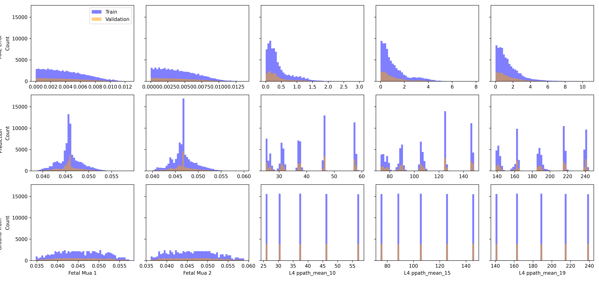

Applying Physics Loss
=====================

# Objective


Using 80% Random Split to predict mu_a difference with the with no physics term  

# Comments


Yes, with the physics loss, the label loss MSE is slightly better. But ultimately the imporvement is very small. Again, this is done with the intensities as the input and the pathlength and mu as the outputs. Look at the central tendenciy. This was not present when using the pulsation ratio. Also, this is a pretty deep network to boot. Saw similar trends even with larger datasets  

# Data Length


97200  

# Model Used


```
=================================================================
Layer (type:depth-idx)                   Param #
=================================================================
PerceptronBD                             --
├─Sequential: 1-1                        --
│    └─Linear: 2-1                       1,025
│    └─BatchNorm1d: 2-2                  50
│    └─ReLU: 2-3                         --
│    └─Linear: 2-4                       650
│    └─BatchNorm1d: 2-5                  50
│    └─ReLU: 2-6                         --
│    └─Linear: 2-7                       650
│    └─BatchNorm1d: 2-8                  50
│    └─ReLU: 2-9                         --
│    └─Linear: 2-10                      650
│    └─BatchNorm1d: 2-11                 50
│    └─ReLU: 2-12                        --
│    └─Linear: 2-13                      650
│    └─BatchNorm1d: 2-14                 50
│    └─ReLU: 2-15                        --
│    └─Linear: 2-16                      650
│    └─BatchNorm1d: 2-17                 50
│    └─ReLU: 2-18                        --
│    └─Linear: 2-19                      572
│    └─Flatten: 2-20                     --
=================================================================
Total params: 5,147
Trainable params: 5,147
Non-trainable params: 0
=================================================================
```  

# Loss


Label Loss(training): 0.07535973897105769,
                       Label loss(validation): 0.0742679360861841,
                       Physics Loss(training): 8.138835308177237e-05
                       Physics Loss(validation): 8.069907150791933e-05  

# Loss Functions Used


Label Loss & BL Pathlength Loss, with weights: [1.0, 0.0]  

# Model Trainer Params


```

        Model Properties:
        PerceptronBD(
  (model): Sequential(
    (0): Linear(in_features=40, out_features=25, bias=True)
    (1): BatchNorm1d(25, eps=1e-05, momentum=0.1, affine=True, track_running_stats=True)
    (2): ReLU()
    (3): Linear(in_features=25, out_features=25, bias=True)
    (4): BatchNorm1d(25, eps=1e-05, momentum=0.1, affine=True, track_running_stats=True)
    (5): ReLU()
    (6): Linear(in_features=25, out_features=25, bias=True)
    (7): BatchNorm1d(25, eps=1e-05, momentum=0.1, affine=True, track_running_stats=True)
    (8): ReLU()
    (9): Linear(in_features=25, out_features=25, bias=True)
    (10): BatchNorm1d(25, eps=1e-05, momentum=0.1, affine=True, track_running_stats=True)
    (11): ReLU()
    (12): Linear(in_features=25, out_features=25, bias=True)
    (13): BatchNorm1d(25, eps=1e-05, momentum=0.1, affine=True, track_running_stats=True)
    (14): ReLU()
    (15): Linear(in_features=25, out_features=25, bias=True)
    (16): BatchNorm1d(25, eps=1e-05, momentum=0.1, affine=True, track_running_stats=True)
    (17): ReLU()
    (18): Linear(in_features=25, out_features=22, bias=True)
    (19): Flatten(start_dim=1, end_dim=-1)
  )
)
        Optimizer Properties"
        SGD (
Parameter Group 0
    dampening: 0
    differentiable: False
    foreach: None
    lr: 0.001
    maximize: False
    momentum: 0.91
    nesterov: False
    weight_decay: 0.0001
)
        DataLoader Params: 
            Batch Size: 4096
            Validation Method: Split the data randomly using np.random.shuffle with a split of 0.8
        Loss:
            Train Loss: 0.07535973897105769
            Val. Loss: 0.0742679360861841
```  

# Loss Curves
  
  
  

# Prediction & Error Distribution
  
  
  
