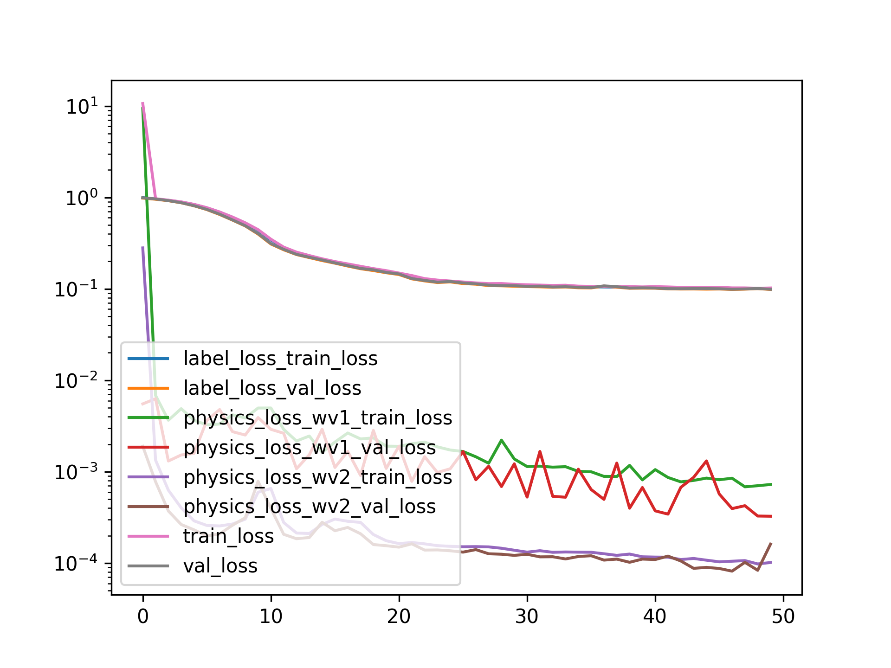
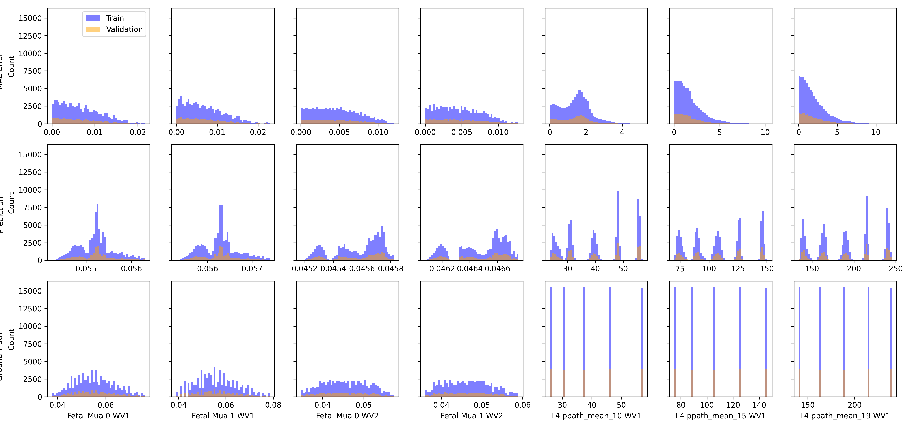

Applying Physics Loss
=====================

# Objective


Using 80% Random Split to predict 4 mu_a's with Physics Loss for Both waveleghts  

# Comment


Using a very small weight on the physics loss - otherwise they tend to explode the gradients. But with this small weight, they seem to make the training actually worse!  

# Model Used


```
=================================================================
Layer (type:depth-idx)                   Param #
=================================================================
PerceptronBD                             --
├─Sequential: 1-1                        --
│    └─Linear: 2-1                       4,050
│    └─BatchNorm1d: 2-2                  100
│    └─ReLU: 2-3                         --
│    └─Linear: 2-4                       2,550
│    └─BatchNorm1d: 2-5                  100
│    └─ReLU: 2-6                         --
│    └─Linear: 2-7                       2,244
│    └─Flatten: 2-8                      --
=================================================================
Total params: 9,044
Trainable params: 9,044
Non-trainable params: 0
=================================================================
```  

# Unnormalized Errors


```
       Fetal Mua 0 WV1 Error  Fetal Mua 1 WV1 Error  Fetal Mua 0 WV2 Error  \
count           7.776000e+04           77760.000000           7.776000e+04   
mean            6.667784e-03               0.006833           4.591172e-03   
std             4.690017e-03               0.004802           2.875972e-03   
min             6.608834e-07               0.000001           1.716772e-07   
25%             2.770185e-03               0.002906           2.163211e-03   
50%             5.883343e-03               0.006021           4.361178e-03   
75%             9.888835e-03               0.010078           6.741471e-03   
max             2.170144e-02               0.022797           1.206396e-02   

       Fetal Mua 1 WV2 Error  
count           7.776000e+04  
mean            4.695111e-03  
std             2.980346e-03  
min             4.778164e-08  
25%             2.165805e-03  
50%             4.418341e-03  
75%             6.948311e-03  
max             1.278206e-02  

       Fetal Mua 0 WV1 Error  Fetal Mua 1 WV1 Error  Fetal Mua 0 WV2 Error  \
count           19440.000000           1.944000e+04           19440.000000   
mean                0.006622           6.784445e-03               0.004619   
std                 0.004687           4.798818e-03               0.002886   
min                 0.000001           7.449725e-08               0.000002   
25%                 0.002714           2.848236e-03               0.002183   
50%                 0.005863           5.964979e-03               0.004387   
75%                 0.009852           1.006168e-02               0.006755   
max                 0.021580           2.267221e-02               0.012063   

       Fetal Mua 1 WV2 Error  
count           1.944000e+04  
mean            4.724336e-03  
std             2.992998e-03  
min             6.288014e-07  
25%             2.202124e-03  
50%             4.459285e-03  
75%             6.964334e-03  
max             1.278058e-02  
```  

# Loss


Label Loss(training): 0.10151005011836164,
                       Label loss(validation): 0.09858243226220734  

# Model Trainer Params


```

        Model Properties:
        PerceptronBD(
  (model): Sequential(
    (0): Linear(in_features=80, out_features=50, bias=True)
    (1): BatchNorm1d(50, eps=1e-05, momentum=0.1, affine=True, track_running_stats=True)
    (2): ReLU()
    (3): Linear(in_features=50, out_features=50, bias=True)
    (4): BatchNorm1d(50, eps=1e-05, momentum=0.1, affine=True, track_running_stats=True)
    (5): ReLU()
    (6): Linear(in_features=50, out_features=44, bias=True)
    (7): Flatten(start_dim=1, end_dim=-1)
  )
)
        Data Loader Properties:
        97200 rows, 80 x columns, 44 y columns
        Batch Size: 512
        X Columns: ['10_2.0_1', '15_2.0_1', '19_2.0_1', '24_2.0_1', '28_2.0_1', '33_2.0_1', '37_2.0_1', '41_2.0_1', '46_2.0_1', '50_2.0_1', '55_2.0_1', '59_2.0_1', '64_2.0_1', '68_2.0_1', '72_2.0_1', '77_2.0_1', '81_2.0_1', '86_2.0_1', '90_2.0_1', '94_2.0_1', '10_1.0_1', '15_1.0_1', '19_1.0_1', '24_1.0_1', '28_1.0_1', '33_1.0_1', '37_1.0_1', '41_1.0_1', '46_1.0_1', '50_1.0_1', '55_1.0_1', '59_1.0_1', '64_1.0_1', '68_1.0_1', '72_1.0_1', '77_1.0_1', '81_1.0_1', '86_1.0_1', '90_1.0_1', '94_1.0_1', '10_2.0_2', '15_2.0_2', '19_2.0_2', '24_2.0_2', '28_2.0_2', '33_2.0_2', '37_2.0_2', '41_2.0_2', '46_2.0_2', '50_2.0_2', '55_2.0_2', '59_2.0_2', '64_2.0_2', '68_2.0_2', '72_2.0_2', '77_2.0_2', '81_2.0_2', '86_2.0_2', '90_2.0_2', '94_2.0_2', '10_1.0_2', '15_1.0_2', '19_1.0_2', '24_1.0_2', '28_1.0_2', '33_1.0_2', '37_1.0_2', '41_1.0_2', '46_1.0_2', '50_1.0_2', '55_1.0_2', '59_1.0_2', '64_1.0_2', '68_1.0_2', '72_1.0_2', '77_1.0_2', '81_1.0_2', '86_1.0_2', '90_1.0_2', '94_1.0_2']
        Y Columns: ['Fetal Mua 0 WV1', 'Fetal Mua 1 WV1', 'Fetal Mua 0 WV2', 'Fetal Mua 1 WV2', 'L4 ppath_mean_10 WV1', 'L4 ppath_mean_15 WV1', 'L4 ppath_mean_19 WV1', 'L4 ppath_mean_24 WV1', 'L4 ppath_mean_28 WV1', 'L4 ppath_mean_33 WV1', 'L4 ppath_mean_37 WV1', 'L4 ppath_mean_41 WV1', 'L4 ppath_mean_46 WV1', 'L4 ppath_mean_50 WV1', 'L4 ppath_mean_55 WV1', 'L4 ppath_mean_59 WV1', 'L4 ppath_mean_64 WV1', 'L4 ppath_mean_68 WV1', 'L4 ppath_mean_72 WV1', 'L4 ppath_mean_77 WV1', 'L4 ppath_mean_81 WV1', 'L4 ppath_mean_86 WV1', 'L4 ppath_mean_90 WV1', 'L4 ppath_mean_94 WV1', 'L4 ppath_mean_10 WV2', 'L4 ppath_mean_15 WV2', 'L4 ppath_mean_19 WV2', 'L4 ppath_mean_24 WV2', 'L4 ppath_mean_28 WV2', 'L4 ppath_mean_33 WV2', 'L4 ppath_mean_37 WV2', 'L4 ppath_mean_41 WV2', 'L4 ppath_mean_46 WV2', 'L4 ppath_mean_50 WV2', 'L4 ppath_mean_55 WV2', 'L4 ppath_mean_59 WV2', 'L4 ppath_mean_64 WV2', 'L4 ppath_mean_68 WV2', 'L4 ppath_mean_72 WV2', 'L4 ppath_mean_77 WV2', 'L4 ppath_mean_81 WV2', 'L4 ppath_mean_86 WV2', 'L4 ppath_mean_90 WV2', 'L4 ppath_mean_94 WV2']
        Extra Columns: ['MAX_ACbyDC_WV1_0', 'MAX_ACbyDC_WV1_1', 'MAX_ACbyDC_WV1_2', 'MAX_ACbyDC_WV1_3', 'MAX_ACbyDC_WV1_4', 'MAX_ACbyDC_WV1_5', 'MAX_ACbyDC_WV1_6', 'MAX_ACbyDC_WV1_7', 'MAX_ACbyDC_WV1_8', 'MAX_ACbyDC_WV1_9', 'MAX_ACbyDC_WV1_10', 'MAX_ACbyDC_WV1_11', 'MAX_ACbyDC_WV1_12', 'MAX_ACbyDC_WV1_13', 'MAX_ACbyDC_WV1_14', 'MAX_ACbyDC_WV1_15', 'MAX_ACbyDC_WV1_16', 'MAX_ACbyDC_WV1_17', 'MAX_ACbyDC_WV1_18', 'MAX_ACbyDC_WV1_19', 'MAX_ACbyDC_WV2_0', 'MAX_ACbyDC_WV2_1', 'MAX_ACbyDC_WV2_2', 'MAX_ACbyDC_WV2_3', 'MAX_ACbyDC_WV2_4', 'MAX_ACbyDC_WV2_5', 'MAX_ACbyDC_WV2_6', 'MAX_ACbyDC_WV2_7', 'MAX_ACbyDC_WV2_8', 'MAX_ACbyDC_WV2_9', 'MAX_ACbyDC_WV2_10', 'MAX_ACbyDC_WV2_11', 'MAX_ACbyDC_WV2_12', 'MAX_ACbyDC_WV2_13', 'MAX_ACbyDC_WV2_14', 'MAX_ACbyDC_WV2_15', 'MAX_ACbyDC_WV2_16', 'MAX_ACbyDC_WV2_17', 'MAX_ACbyDC_WV2_18', 'MAX_ACbyDC_WV2_19']
        Validation Method:
        Split the data randomly using np.random.shuffle with a split of 0.8
        Loss Function:
        Sum of multiple loss functions. 
        Constituent Losses: ['label_loss', 'physics_loss_wv1', 'physics_loss_wv2']
        Weights: [1.0, 0.5, 0.5]
        Individual Loss Func Description:
        Torch Loss Function: MSELoss()
Beer-Lamberts Law based Physics loss comparing the predicted pulsation ratio to the ground truth(using the pathlengths and mu_a values)
Beer-Lamberts Law based Physics loss comparing the predicted pulsation ratio to the ground truth(using the pathlengths and mu_a values)
        
        Optimizer Properties":
        SGD (
Parameter Group 0
    dampening: 0
    differentiable: False
    foreach: None
    lr: 0.001
    maximize: False
    momentum: 0.91
    nesterov: False
    weight_decay: 0.0001
)
        
```  

# Loss Curves
  
  
  

# Prediction & Error Distribution
  
  
  
