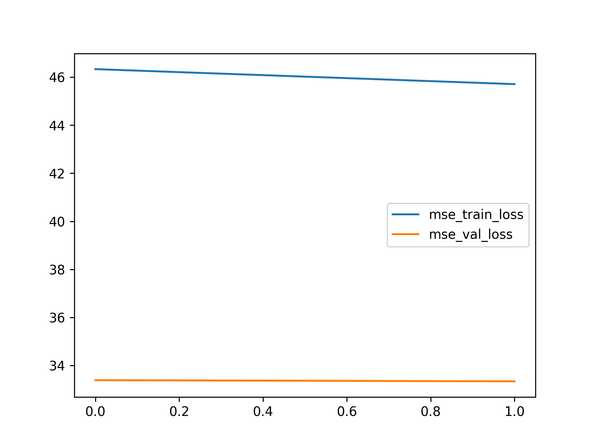

Example Report
==============

# Objective


Training Models using the ModelTrainer Class  

# Model Used


```
=================================================================
Layer (type:depth-idx)                   Param #
=================================================================
PerceptronBD                             --
├─Sequential: 1-1                        --
│    └─Linear: 2-1                       6
│    └─BatchNorm1d: 2-2                  4
│    └─Dropout1d: 2-3                    --
│    └─ReLU: 2-4                         --
│    └─Linear: 2-5                       3
│    └─Flatten: 2-6                      --
=================================================================
Total params: 13
Trainable params: 13
Non-trainable params: 0
=================================================================
```  

# Loss Curves
  
  
  
