# Fitting Data Generated Using Saturation/Concentration Based Models

## Intro
The spatial intensity generated at multiple wavelengths is connected via the internal saturation. In this dataset, we try to emulate this by setting the $\mu_a$ parameter of both the maternal layer(Layer 1) and fetal layer(Layer 4) based on their individual saturation and concentration. We tried to run different types of models to guess the tissue model parameters used to generate the spatial intensity. Most approaches try to determine only one parameter at a time. 

## Notes
1. I could not use the true blood concetrations to calculate the $\mu_a$'s. These values were very high and ended up making the spatial intensity curves dip very far down(Around 1e-30 in the far detectors). This made the far detector intensity very noisy. I ended up lowering the concentration on the fetal layer only.
2. Primarily, I only used maternal wall thickness upto 6mm. Whereas, the fetal layer is 50mm thick. So the thin maternal wall's $\mu_a$ has a much weaker effect. I checked this with plots - and eventually decided on giving 100x larger blood concentration to the maternal wall compared to fetal. 
3. Fetal blood definitely has a different set of properties compared to maternal blood. But the absorption should still rely heavily on the Hb content. In this experiment, the extinction co-effs for Hb and HbO for both maternal and fetal blood is assumed to be same as well the only component in absorption.(i.e, its so large, the other pigments play a very negligible part)
4. The input to the models should be : Spatial intensities at 20 detectors + at 2 wavelengths/ Ratios / Extra maternal info. The output is the parameters used to generate the data. 
5. In the beginning, my models started to guess the mean of the training data rather than actually learn anything. But I figured this was due to normalization. Which is tricky in this context. First thing, the intensities drop logarithmically. ie., the far intensities are far far far smaller than the near ones. Which means, the only way to make those relevant is to take their log(Which also I normalized between 0 and 1)
6. When using the larger blood concentration('data/intensity/s_based_intensity.pkl'), the maternal was very easy to predict. Most errors being under 5% and avrg mse in 1e-5 range. The fetal was nearly impossible. But dropping to the lower blood conc. values ('data/intensity/s_based_intensity_low_conc.pkl'), the fetal was somewhat predictable. (#Note: On this file, the blood conc. on maternal is too low and it does not change the curves - maternal values cannot be predicted from here)
7. The train/val split is always 80/20 with a fixed seed of 70. The data is shuffled during each epoch. SGD optimizer, MSE error. Using RayTune for hyper param tuning. Picks the best params to minimize __train loss x val loss__ . (I was taking the summation, but that either emphasized train or val loss). Running 100 tries/20 at a time
8. I tried HuberLoss but it usually doesn't work well
9. Using interpolation on the intensity before taking logarithm
10. The top errors are always for the 6mm model

## Models Used
1. Perceptron with ReLu - Simple perceptron with 1/2 hidden layers. However, the data sample is not that high and the FC models quickly ramp up in parameter count!
2. 2 Channel CNN + FC - 2 different input channels taking in the spatial intensity at multiple wavelengths with a FC at the end making the prediction(Conneteced by ReLus)
3. Ratio - takes the ratio of intensities as the input - either CNN or ANN

## TODOs
1. Using 0mean unit-variance normalization. Can something else work? It seems to affect the performance quite a bit
2. Maybe have one data point of higher depth?

## Model Performance
Train/Test Split 80/20 (Seed: 70)
### Predicting Maternal Hb Conc.
#### Ratio + Spatial Intensity, 3-channel CNN 
MSE : 1e-3 (Both train/val) on normalized labels  
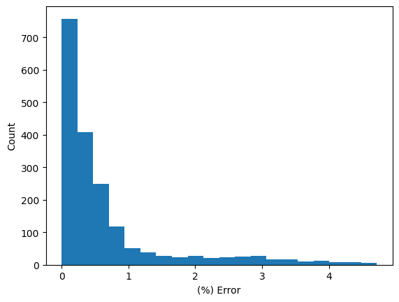  
Largest errors incurred for the largest thickness (6mm) / Thickest conc. (16)
{'lr': 0.0002206574543783307, 'batch_size': 8, 'momentum': 0.97}  {'model_class': inverse_modelling_tfo.models.custom_models.SplitChannelCNN,
 'model_params': [3, 60, 6, 7, [3, 1]],
 'train_split': 0.8}

#### Ratio + Spatial Intensity, Perceptron
MSE : 1e-3/2e-3 (Both val/train) on normalized labels 
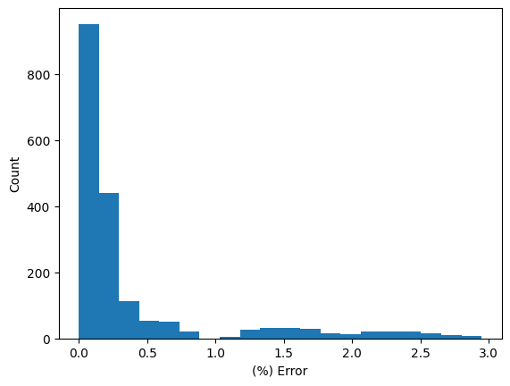  
Largest errors incurred for the largest thickness (6mm) / Thickest conc. (16) 
{'lr': 0.0009715279968497483, 'batch_size': 8, 'momentum': 0.93}  {'model_class': inverse_modelling_tfo.models.custom_models.PerceptronReLU,
 'model_params': [[60, 8, 1]],
 'train_split': 0.8,
 'epochs': 50}  
 model param 497

#### Spatial Intensity, Perceptron  
MSE : Train/Val 1e-4/3e-5 on normalized labels 
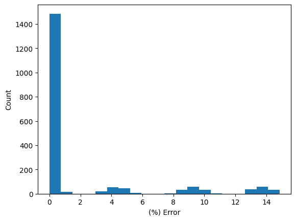  
{'lr': 0.0008667218490316007, 'batch_size': 8, 'momentum': 0.97}  
{'model_class': inverse_modelling_tfo.models.custom_models.PerceptronReLU,
 'model_params': [[40, 8, 1]],
 'train_split': 0.8,
 'epochs': 50} (The overall performance is better but for the bad cases, its worse)
model param 337 

### Predicting Fetal Hb Conc
#### Ratio + Spatial Intensity, Perceptron
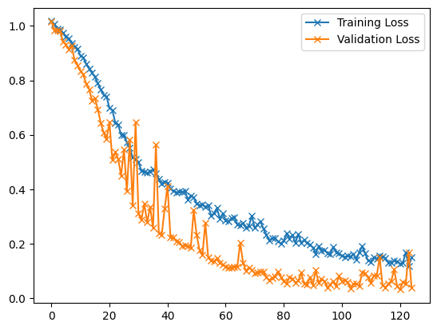  
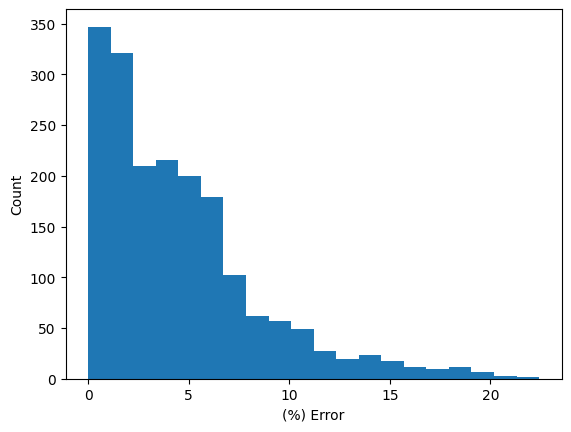  
Train MSE : 0.14869143502747126, Val MSE : 0.03905152779151785, {'model_class': inverse_modelling_tfo.models.custom_models.PerceptronReLU,
 'model_params': [[60, 8, 1]],
 'train_split': 0.8,
 'epochs': 50}, {'lr': 0.00025, 'batch_size': 8, 'momentum': 0.94}

#### Ratio + Spatial Intensity, Split Channel CNN  
Train MSE : 0.42681105581032946, Val MSE : 0.024149980514924577
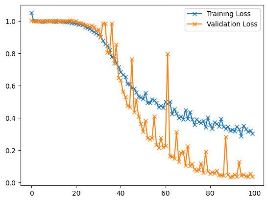  
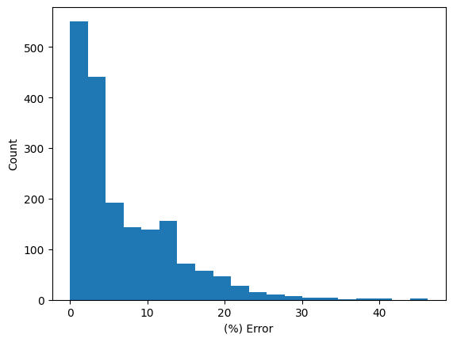  
{'model_class': inverse_modelling_tfo.models.custom_models.SplitChannelCNN,
 'model_params': [3, 60, 6, 7, [3, 1]],
 'train_split': 0.8,
 'epochs': 50}, {'lr': 0.0006514143464572793, 'batch_size': 8, 'momentum': 0.93}

### Predicting Maternal Sat.
Train MSE : 0.001627553783846645, Val MSE : 0.0009969474776880816, 
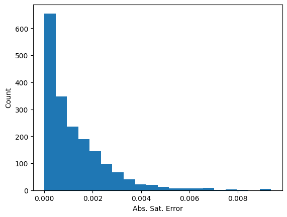 
{'model_class': inverse_modelling_tfo.models.custom_models.SplitChannelCNN,
 'model_params': [3, 60, 6, 7, [3, 1]],
 'train_split': 0.8,
 'epochs': 50}, {'lr': 0.0008026283729679813, 'batch_size': 8, 'momentum': 0.93},
 Largest errors incurred for the largest thickness (6mm)/ lower sat end, Trainable params: 307

### Predicting Fetal Sat.
#### Ratio + Spatial Intensity, Split Channel CNN 
Train MSE : 0.11205603721293997, Val MSE : 0.018043352855726124, 
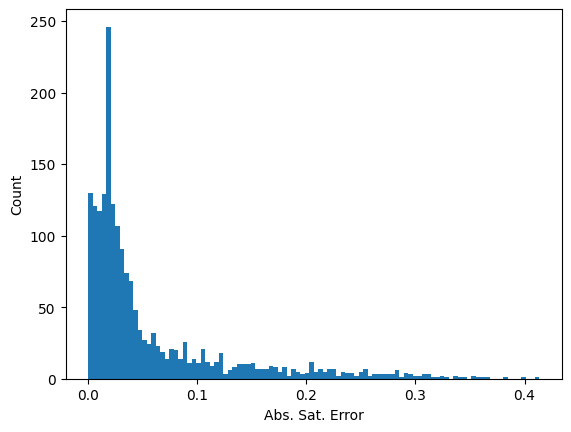, {'model_class': inverse_modelling_tfo.models.custom_models.SplitChannelCNN,
 'model_params': [3, 60, 6, 7, [3, 1]],
 'train_split': 0.8,
 'epochs': 50}, {'model_class': inverse_modelling_tfo.models.custom_models.SplitChannelCNN,
 'model_params': [3, 60, 6, 7, [3, 1]],
 'train_split': 0.8,
 'epochs': 150}
 Largest errors incurred for the largest thickness (6mm)/ lower sat end, Trainable params: 307, Train Error(non-normalized): [0.00350175]
Validation Error(non-normalized): [0.00056385], (A bit finicky to train)

#### Ratio + Spatial Intensity, Perceptron
Train MSE : 0.05002032499017313, Val MSE : 0.04044787688775266
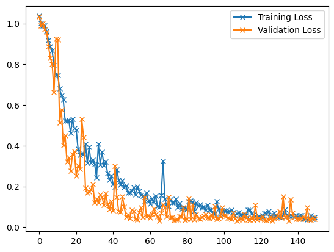
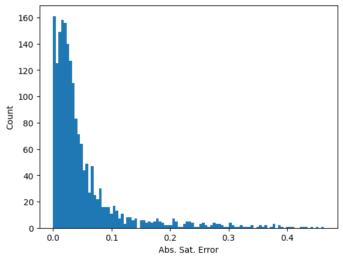
Worst error occur at the highest thickness/largest maternal Hb Conc., {'model_class': inverse_modelling_tfo.models.custom_models.PerceptronReLU,
 'model_params': [[60, 8, 1]],
 'train_split': 0.8,
 'epochs': 140}, {'lr': 0.0007742859341147274, 'batch_size': 8, 'momentum': 0.95}

#### Ratio, Perceptron  
Train MSE : 0.7698480937867722, Val MSE : 0.8465105764409329, 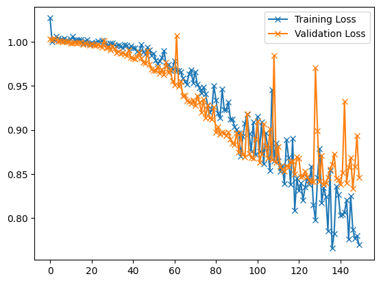
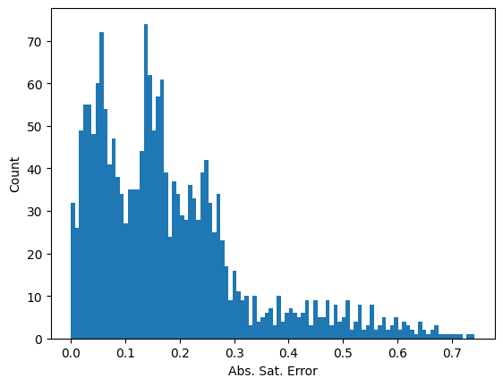, {'model_class': inverse_modelling_tfo.models.custom_models.PerceptronReLU,
 'model_params': [[20, 8, 1]],
 'train_split': 0.8,
 'epochs': 100}, {'lr': 0.0002887067743586193, 'batch_size': 8, 'momentum': 0.97}